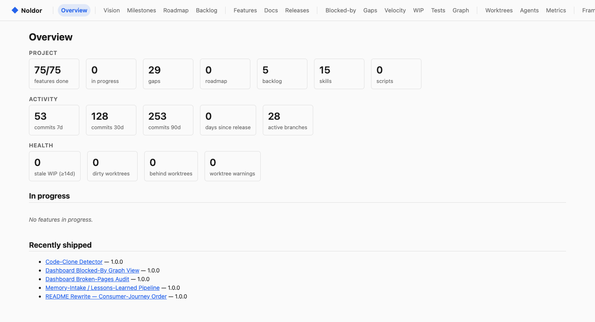
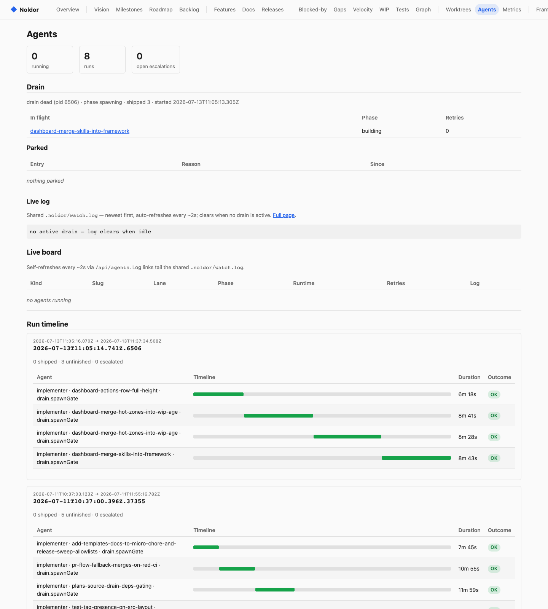
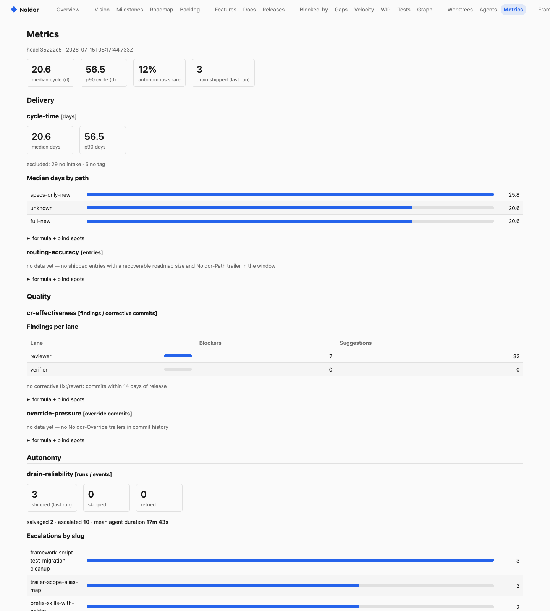
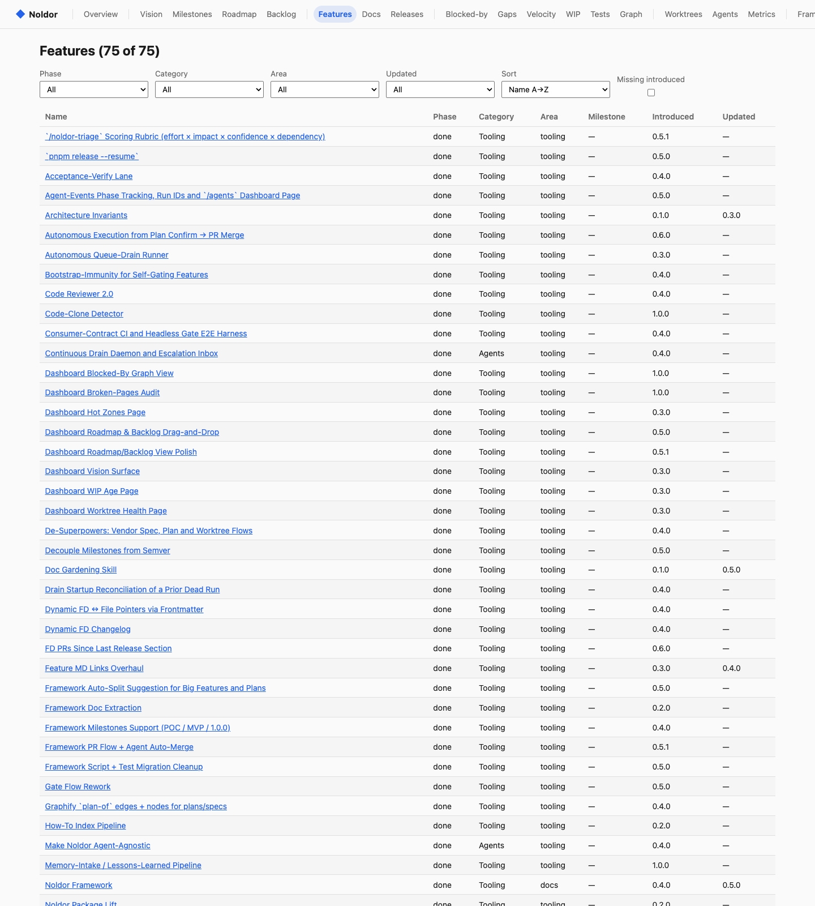
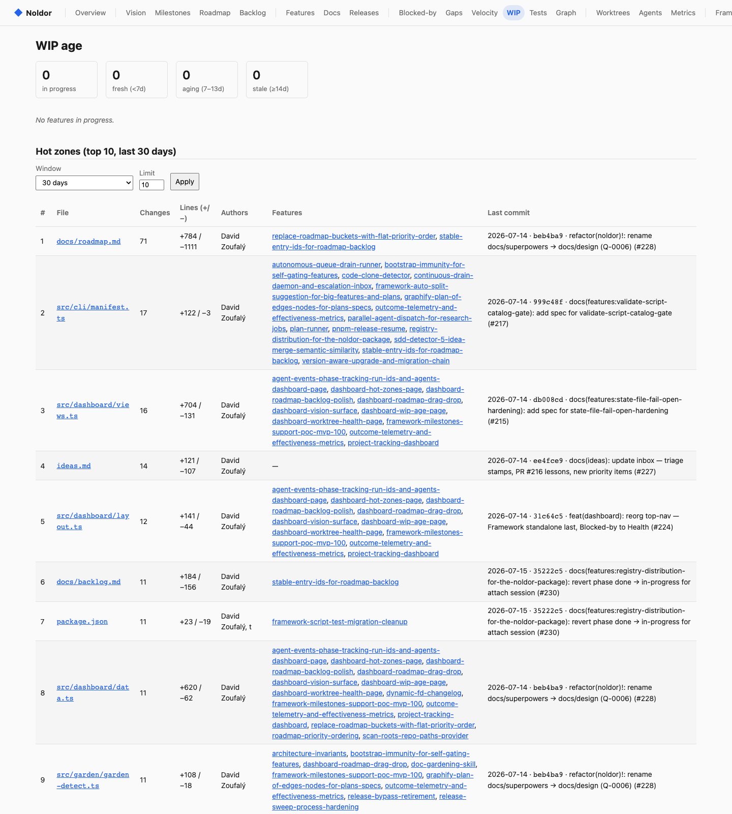

# Noldor

**A discipline framework for agent-driven software development.** One mandatory gate for every code change, features anchored in docs, and an autonomous queue that ships small work while you sleep — with a live dashboard watching the whole pipeline.

```bash
pnpm add -D @david.zoufaly/noldor
```

[](https://www.npmjs.com/package/@david.zoufaly/noldor) · Node ≥ 20 · pnpm ≥ 9 · MIT

> New here, or adopting into an existing repo? The **[adoption guide](docs/noldor/adoption-guide.md)** is the full onboarding path. This README is the map; the guide is the territory.

---

## What it does

- 🚪 **One gate, no bypass.** `/noldor-gate` is the single entry for any code change. It picks one of **six complexity paths** (`micro-chore`, `fast-track`, `specs-only-new`, `specs-only-attach`, `full-new`, `full-attach`), scaffolds the matching artifacts, and drives the change to an auto-merged PR. Commit hooks reject anything that skipped the gate.
- 📄 **Docs anchor code.** Every feature is a doc (`docs/features/*.md`) with a spec and a plan behind it. Roadmap → backlog → feature → spec → plan → code, all traceable.
- 🤖 **Autonomous drain.** Queue fast-track work and let a headless daemon ship it — fresh gate run per entry, salvage on conflict, escalation inbox for anything it can't finish alone.
- 🔍 **Unsupervised code review.** Spec / plan / code lanes with configurable review profiles (effort × dimensions), a verify lane, and a red-CI merge guard.
- 📊 **Live dashboard.** Roadmap, feature phases, WIP age & hot zones, worktree health, agent-run timelines, delivery/quality/autonomy metrics, and a blocked-by dependency graph.
- 🩺 **Doctor + upgrade.** `doctor` probes the prerequisite floor and template skew; `upgrade` walks a versioned migration chain.
- 🌳 **Per-feature worktrees.** Isolated worktrees per task so parallel work never collides.
- 🧹 **Doc gardening.** Detectors surface stale plans, unused backlog, rule-pair contradictions, code clones, and command rot.
- 🔗 **Knowledge graphs.** `graphify` turns the codebase into a clustered knowledge graph feeding refactor and release sweeps.
- 🧩 **Agent-agnostic.** Driver shims for `claude`, `codex`, and `opencode`.
- ♻️ **Self-hosting.** Noldor dogfoods its own gate, drain, and release pipeline. Shipped as the public npm package `noldor`, published on tag by CI with build provenance.

---

## Dashboard

```bash
pnpm noldor dashboard server --port 4321 --docs ./docs
```

**Overview** — project, activity, and health at a glance:



**Agents** — live drain state, run timelines, and per-agent durations:



**Metrics** — cycle-time, routing accuracy, CR effectiveness, and drain reliability:



**Features** — every feature doc with phase, category, and version:



**WIP age & hot zones** — aging work and the files churning most:



---

## Quick start

```bash
pnpm add -D @david.zoufaly/noldor            # monorepo: add -w  ·  CI: npm ci resolves from public npm, no token
pnpm noldor init              # scaffold docs/noldor, hooks, .noldor/config.json, rollout marker
pnpm noldor init --adopt      # OR reverse-bootstrap an existing repo into the layout
pnpm noldor doctor            # prerequisite + template-skew health check → green
```

`init` drops the rule pages, lefthook config, skill bundle, a starter `.noldor/config.json`, and `.noldor/rollout-marker` (arms the gate — **commit it**). Once tracked, the pre-edit guard arms and the next edit to a tracked file requires a `/noldor-gate` session. Re-pull templates with `--update`; pick driver shims with `--agents claude,codex,opencode`.

**Prerequisites (non-negotiable pre-1.0):** Node ≥ 20, pnpm ≥ 9, git ≥ 2.30, gh CLI ≥ 2, lefthook ≥ 1, plus `lint` / `fmt` / `fmt:check` / `test` scripts. `pnpm noldor doctor` probes every row. Full table: the [adoption guide](docs/noldor/adoption-guide.md).

---

## Daily workflow

`/noldor-gate` is the single mandatory entry. Pick a path, it scaffolds the artifacts (feature doc, spec, plan) and drives to an auto-merged PR:

| Path | For |
| --- | --- |
| `micro-chore` | Tiny, no-artifact changes |
| `fast-track` | Small changes, minimal ceremony |
| `specs-only-new` / `specs-only-attach` | Spec required, no plan |
| `full-new` / `full-attach` | Spec + plan + full lifecycle |

Start here: [`lifecycle.md`](docs/noldor/lifecycle.md), [`complexity-gating.md`](docs/noldor/complexity-gating.md), [`workflow.md`](docs/noldor/workflow.md).

---

## Autonomous drain

Ship queued fast-track work with no operator in the loop — each entry ships via a fresh headless gate run:

```bash
pnpm noldor autonomous run             # drain a source (--source roadmap|plans)
pnpm noldor autonomous watch --detach  # continuous unattended daemon
pnpm noldor autonomous status          # what is in flight
pnpm noldor autonomous inbox           # open escalations (parked slugs + evidence)
```

See [`drain-mode.md`](docs/noldor/drain-mode.md) and [`autonomy.md`](docs/noldor/autonomy.md).

---

## Configure

Every consumer ships `.noldor/config.json` with a `consumer:` block (repo URL, boundaries, path prefixes). Validate it:

```bash
pnpm noldor validate noldor-config
```

Eight optional top-level blocks unlock extra behaviour, all defaulting sanely: `crLanes`, `crReview`, `autonomous`, `gate`, `agents`, `release`, `garden`, `clones`. The CR blocks drive unsupervised review and PR-merge — see [`cr-pipeline.md`](docs/noldor/cr-pipeline.md). Annotated field table: the [adoption guide](docs/noldor/adoption-guide.md).

---

## CLI reference

`pnpm noldor --help` prints the full manifest — this is the journey-critical subset, **not exhaustive**. Every script is catalogued in [`script-catalog.md`](docs/noldor/script-catalog.md).

| Group | What it does |
| --- | --- |
| `init` | Scaffold or adopt Noldor into a repo |
| `doctor` | Prerequisite + template-skew health check |
| `dashboard` | Serve the product/framework dashboard |
| `autonomous` | Queue-drain / watch daemon / escalation inbox |
| `upgrade` | Apply version migrations |
| `cr` | Code-review orchestration (spec / plan / code lanes) |
| `pr-flow` | Push → PR → auto-merge |
| `worktrees` | Per-feature isolated worktrees |
| `graphify` | Build a knowledge graph of the codebase |

---

## Upgrading

After pulling a newer framework version, `doctor` warns on schema skew. Review migration diffs, then apply on a clean branch:

```bash
pnpm noldor upgrade --dry-run
pnpm noldor upgrade
```

Migration-chain and semver policy: [`versioning.md`](docs/noldor/versioning.md).

---

## Docs

The framework rule pages live under [`docs/noldor/`](docs/noldor/README.md) — that index is the single source of truth, keyed by what you are trying to do.

## Contributing

Framework contributors work against a clone. A consumer repo on the same machine can point at it with a `file:` dependency (assumes `noldor/` is a sibling, e.g. `~/code/noldor/` next to `~/code/charuy/`):

```json
{ "devDependencies": { "@david.zoufaly/noldor": "file:../noldor" } }
```

```bash
pnpm install && pnpm build && pnpm test && pnpm typecheck
```

## License

MIT (see `LICENSE`).
