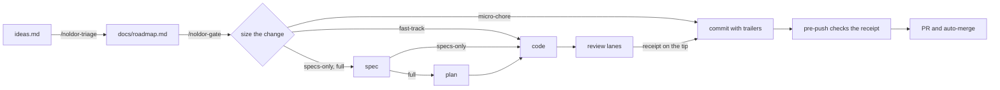
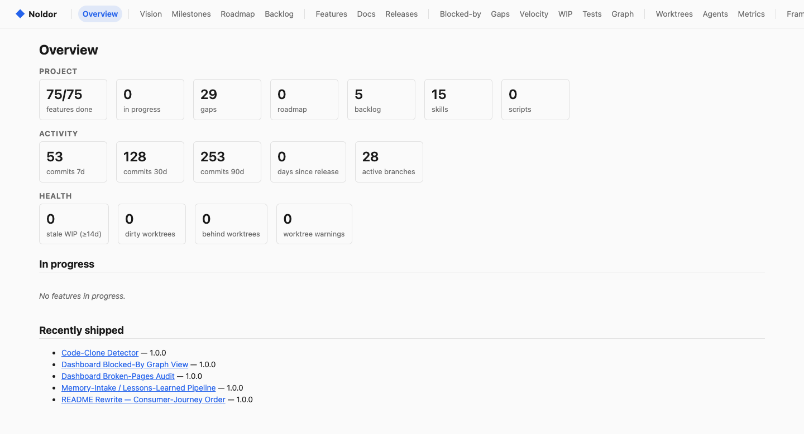
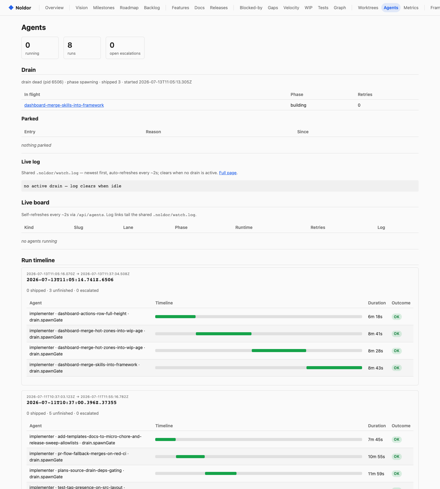
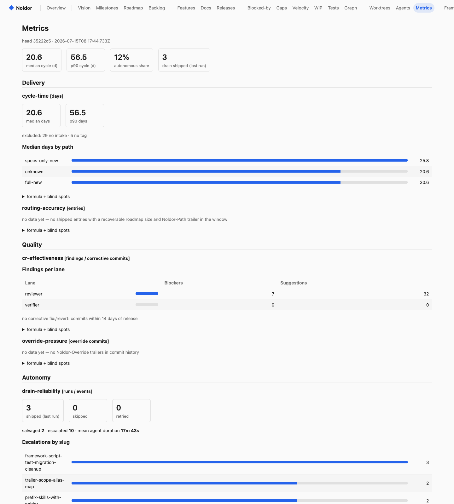
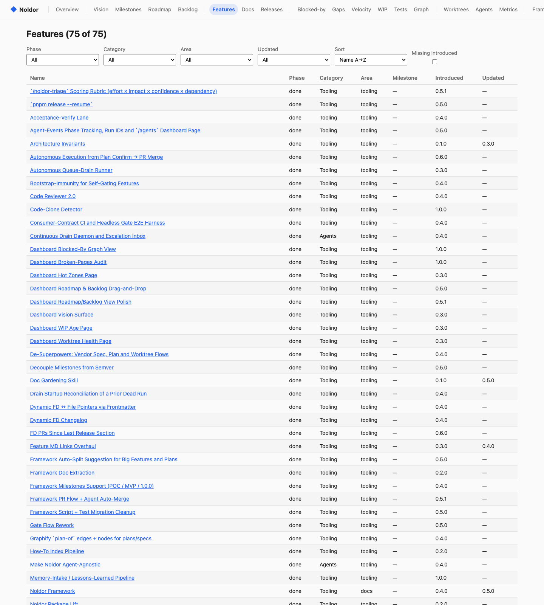
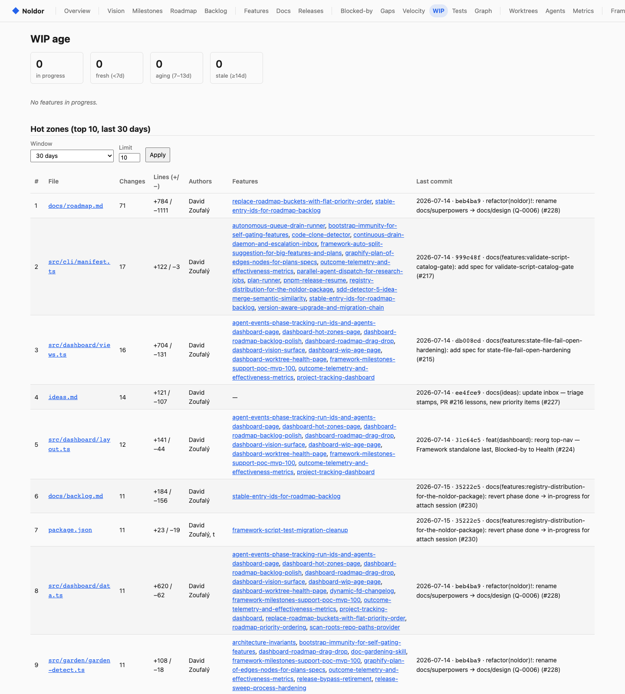

# Noldor

Noldor is a discipline framework for repositories where agents write most of the code. Every change starts at one gate. The gate sizes the change, picks one of six paths, and scaffolds what that path needs: a worktree, a feature doc, a spec, a plan, a review. Git hooks then check that the artifacts exist, that the commit trailers name them, and that the review receipt on the tip commit still matches the tree being pushed. Edit a file after review and the receipt dies with it.

It is a CLI, a set of lefthook jobs that shell into that CLI, and a folder of JSON and markdown committed next to your code. There is no server and no database. Everything Noldor knows can be read with `git log` and a text editor.

```bash
pnpm add -D @david.zoufaly/noldor
```

[](https://www.npmjs.com/package/@david.zoufaly/noldor) Node 24 or newer, pnpm 9 or newer, MIT.

This page explains what Noldor is and whether you want it. The [adoption guide](docs/noldor/adoption-guide.md) gets it installed in a real repo, including the traps.

## The problem

An agent will write a feature in twenty minutes. It will also skip the spec, forget the test, amend a commit that was already reviewed, and push to main, because nothing stops it. Instructions in a CLAUDE.md are suggestions. The model reads them, agrees with them, and drifts anyway a few hours into a session.

Noldor's bet is that discipline has to be mechanical. If a rule is not enforced by a hook with an exit code, it is not a rule. So the framework moves every rule it cares about out of prose and into git hooks, commit trailers, and files the CLI writes and validates.

## How a change moves through it

Whoever starts work, a person or an agent, runs `/noldor-gate` first. The gate reads the top of `docs/roadmap.md`, proposes an entry, and picks a path for it based on the entry's size. Then it scaffolds what that path needs and writes `.noldor/session.json`, the session marker. From then on the hooks know which path you are on and what they may demand of you.


```mermaid
flowchart LR
  ideas[ideas.md] -->|/noldor-triage| roadmap[docs/roadmap.md]
  roadmap -->|/noldor-gate| gate{size the change}
  gate -->|micro-chore| commit
  gate -->|fast-track| code
  gate -->|specs-only, full| spec
  spec -->|specs-only| code
  spec -->|full| plan --> code
  code --> review[review lanes]
  review -->|receipt on the tip| commit[commit with trailers]
  commit --> push[pre-push checks the receipt]
  push --> pr[PR and auto-merge]
```

Each stage leaves a trace, and the next stage checks it:

| Stage | What is written | What checks it |
| --- | --- | --- |
| Gate | `.noldor/session.json`, naming the path | An editor hook. Once the gate is armed, an Edit or Write to a tracked file with no session is blocked before it happens. |
| Spec, plan | Files under `docs/design/specs/` and `docs/design/plans/` | The `reviewer` lane. It is unioned into every spec and plan review and cannot be switched off. On medium and large entries `codex` is added too, so nothing of that size ships reviewed by one model family. |
| Commit | `Noldor-Path:` and `Noldor-FD:` trailers, injected from the session marker | The commit-msg hook validates scope and trailers, and that a spec file exists when the path says one should. |
| Code review | One JSON sink per lane under `.noldor/cr/` | The aggregate step fails closed on a missing, corrupt, or mismatched sink. |
| Receipt | `Noldor-Reviewed-Subagent: <tree-hash>`, amended onto the tip commit | The pre-push hook compares it to `HEAD^{tree}`. Any edit after review invalidates it. |
| Ship | A PR whose summary is composed from the commits | `pr-flow` refuses to open a PR without a Why, How, and What. The pre-push hook refuses direct pushes to main outright. |

Before the first edit to a file, `pnpm noldor rules brief --file <path>` prints the engineering rules that bind that file. The code review later checks the diff against the same rule text, so rules arrive as guidance first and as findings only if ignored.

Review can loop. A reviewer finds something, you fix it, the fix is new prose, and the reviewer finds something in the fix. Noldor caps that at two red re-rounds per artifact per session, in code, and it detects a reviewer oscillating between two positions. Past the cap you get one closing decision, not another round.

## What gets refused

Most of these are git hooks. The first is an editor hook, and the last is the drain.

- Editing a tracked file with no gate session. Claude Code's PreToolUse hook exits 2 and the edit never lands:

  ```text
  Noldor gate: edits to "src/core/session.ts" require /noldor-gate. Run /noldor-gate before editing.
  ```

- Committing on `micro-chore` with anything outside the allowlist of doc and policy files. One source file taints the whole set, and the rejection names the offenders.
- Committing on a path that requires a spec when no spec file is on disk.
- Pushing a branch whose tip has no review receipt, or whose receipt names a different tree than the one being pushed.
- Pushing to `origin/main` at all. Every path lands through a PR.
- Pushing a skill or rule page that drifted from its twin under `templates/`.
- Shipping an entry headlessly when its body trips the oversize heuristics, however small its `size:` label claims to be. That entry goes to the escalation inbox for a human to re-size or split.

No hook can catch `--no-verify`, so repo policy forbids it. The sanctioned escape is a `Noldor-Path-Override: <reason>` trailer. It is logged, and the garden detectors audit the log.

## Six paths, chosen by size

The gate routes on the entry's `size:` field. You can override the pick, but the default is the policy.

| Size | Path | Worktree | Feature doc | Spec | Plan | Review |
| --- | --- | --- | --- | --- | --- | --- |
| doc-only | `micro-chore` | no | no | no | no | no |
| XS, S | `fast-track` | yes | no | no | no | reviewer |
| M | `specs-only-new`, `specs-only-attach` | yes | new, or a parent | yes | no | reviewer and codex |
| L, XL | `full-new`, `full-attach` | yes | new, or a parent | yes | yes | reviewer and codex |

The `-attach` variants extend an existing feature doc instead of creating one. A missing or unreadable size routes to `specs-only`, never to `fast-track`. The policy does not drop review because it could not read a label.

Two more paths exist that you cannot pick. `release-sweep` covers the regeneration commits before a release and `release-automation` covers the version bump itself. The release script and the sweep skill write their own session markers.

Details: [`complexity-gating.md`](docs/noldor/complexity-gating.md) and [`lifecycle.md`](docs/noldor/lifecycle.md).

## Unattended work

Small entries do not need you. The drain takes fast-track entries off the roadmap one at a time, spawns a fresh headless gate session per entry, and ships each through the same hooks and the same review an interactive session gets. With `--source plans` it ships already-designed features whose spec and plan are committed. `watch` turns the one-shot drain into a daemon.

```bash
pnpm noldor autonomous run              # drain the roadmap once
pnpm noldor autonomous watch --detach   # keep draining on an interval
pnpm noldor autonomous status           # what is running, what shipped, what was skipped
pnpm noldor autonomous inbox            # escalations that need a human
```

The drain refuses to start unless the config is headless-safe: `autonomous.onFailure` set to `abort`, `skipLanePicker` on, `requireHumanPrApproval` off. A child that would need to ask a question fails instead of hanging. The per-entry timeout scales with the entry's size. The daemon has a daily cap, a trip that fires after a run of failures, and an optional notify hook. Whatever it cannot finish, it parks in the inbox with evidence rather than retrying forever.

Do not call it hands-off. It is hands-off for the boring third of the queue, which is the third nobody wants to do by hand.

Details: [`autonomy.md`](docs/noldor/autonomy.md) and [`drain-mode.md`](docs/noldor/drain-mode.md).

## Drift detection

Docs rot faster than code, so Noldor treats them as something to test. `pnpm noldor garden detect` runs more than twenty detectors over the repo: done features without tests, plans without specs, stale backlog, rule pages that contradict each other, quoted commands that no longer exist, and so on. A separate clone detector ratchets code duplication against a committed baseline at push time. The release preflight runs its own row of probes over the same state and names every failing row at once instead of stopping at the first.

The code graph comes from graphify, and a release will not cut against a stale one. This README is checked too. Every documentation surface under `docs/` has to be reachable by following links from here, and every command quoted on this page has to resolve against the live CLI. That is `pnpm noldor checks readme`.

Details: [`garden-and-drift.md`](docs/noldor/garden-and-drift.md).

## Dashboard

```bash
pnpm noldor dashboard server --port 4321 --root .
```

A read-only local view over the same files. It is never a source of truth.

Overview: project, activity, and health.



Agents: live drain state, run timelines, per-agent durations.



Metrics: cycle time, routing accuracy, review effectiveness, drain reliability.



Features: every feature doc with its phase, category, and version.



WIP age and hot zones: work that is aging, and the files that churn most.



## Quick start

```bash
pnpm add -D @david.zoufaly/noldor   # in a pnpm workspace root, add -w
pnpm noldor init                    # scaffold docs/noldor, hooks, skills, .noldor/config.json, rollout marker
pnpm noldor doctor                  # every prerequisite row should be green before the first commit
```

Have an existing repo with its own docs layout? `pnpm noldor init --adopt` reverse-bootstraps it. Choose which agent shims to write with `--agents claude,codex,opencode`. Re-pull the templates later with `--update`.

Three things people trip on:

1. Commit `.noldor/rollout-marker` in the bootstrap commit. It arms the commit-stage gate. The editor guard arms as soon as the file exists.
2. The scaffolded hooks call your `lint`, `fmt`, `fmt:check`, and `test` scripts. Add any you lack before the first commit, or the hooks fail with "missing script".
3. Fill the `consumer:` block in `.noldor/config.json` with real values, then run `pnpm noldor validate noldor-config`.

From the first edit after that commit, the gate is live.

## Is Noldor for you?

Probably yes, if:

- Agents write a large share of your code and you want a trail a human can audit later without replaying the session.
- Your stack is TypeScript, pnpm, git, and GitHub, and you are willing to run lefthook and write Conventional Commits.
- You would rather have a few hard rules than many soft ones.

Probably not, if:

- You want to configure the discipline. Noldor is opinionated by design. The defaults are the framework, and even the size thresholds are constants in source rather than config.
- You cannot meet the floor: Node 24, pnpm 9, git 2.30, gh 2, lefthook 1. `doctor` fails on the first missing row and points at the guide.
- A typo fix going through a gate, a session marker, and a PR sounds like too much. On the `micro-chore` path that takes about a minute, but it is still a PR.

Claude Code is the primary interactive runner. Codex and opencode are first-class for headless roles (review, drain, research) through the runner registry, opencode gets thin command shims, and codex reads `AGENTS.md`. See [`agent-runtimes.md`](docs/noldor/agent-runtimes.md).

## How it is built

Three runnable units and one directory of state. The CLI, `noldor <group> <subcommand>`, is the only entry point. The hook jobs in `lefthook/noldor.yml` shell into it at four git stages. Pre-commit formats, syncs link projections, and validates. Prepare-commit-msg injects trailers from the session marker. Commit-msg checks scope and trailers. Pre-push enforces the review receipt, template parity, and the code-clone ratchet. The dashboard reads the same files over local HTTP.

`.noldor/` holds the durable state as plain files: the session marker, one review sink per lane, the ID counter and retired-ID map, the clone and indirection baselines, scoped engineering rules, and the drain's logs and heartbeat. Documentation lives in `docs/`: feature docs, specs and plans, the roadmap and backlog, four architecture pages, and decision records.

Noldor depends on git, the GitHub CLI, graphify for the code graph, and whichever agent runtimes it dispatches. It never talks to a network service of its own.

The architecture pages carry the diagrams: [context](docs/architecture/context.md), [containers](docs/architecture/containers.md), [modules](docs/architecture/modules.md), [flows](docs/architecture/flows.md).

## Configuration

One file, `.noldor/config.json`. The `consumer:` block is required: repo URL, scan paths, lockstep packages, dependency boundaries, release categories. Nine optional blocks change behaviour, and every one of them has a working default: `crLanes`, `crReview`, `autonomous`, `gate`, `agents`, `release`, `garden`, `clones`, `design`.

```bash
pnpm noldor validate noldor-config
```

A config with only `consumer:` runs review on the `reviewer`-only defaults. Add `crLanes` to opt codex in on small changes as well, `autonomous` to make the drain headless-safe, and `agents` to route roles to codex or opencode. The field table is in the [adoption guide](docs/noldor/adoption-guide.md). The review blocks are explained in [`cr-pipeline.md`](docs/noldor/cr-pipeline.md).

## Command groups

`pnpm noldor --help` prints the whole manifest. These are the groups you meet in the first week. Every script is catalogued in [`script-catalog.md`](docs/noldor/script-catalog.md).

| Group | Does |
| --- | --- |
| `init` | Scaffold or adopt Noldor into a repo |
| `doctor` | Prerequisites, template skew, hook wiring, which runtime is executing, lockfile freshness |
| `dashboard` | Serve the local dashboard |
| `autonomous` | Drain, watch daemon, escalation inbox |
| `cr` | Code-review orchestration across spec, plan, and code lanes |
| `pr-flow` | Push, open the PR, auto-merge, poll until merged |
| `worktrees` | Per-feature isolated worktrees |
| `garden` | Drift detectors and the SDD report |
| `checks` | Invariants, template sync, push-gate replay, README drift |
| `graphify` | Build and query the code knowledge graph |
| `release` | Preflight probes, version bump, changelog, publish |
| `upgrade` | Version-aware migration chain |

## Upgrading

After pulling a newer framework version, `doctor` warns on schema skew. All three commands below are required. `upgrade` runs the codemods and advances the anchor but never re-syncs templates, so a stale hook config survives it and every commit then dies on a subcommand the new version removed.

```bash
pnpm noldor upgrade --dry-run
pnpm noldor upgrade
pnpm noldor init --update
```

Policy: [`versioning.md`](docs/noldor/versioning.md).

## Documentation

- [`docs/noldor/`](docs/noldor/README.md) is the rule set, indexed by what you are trying to do. It is the single source of truth. This README and any project's CLAUDE.md are overlays on it.
- [`docs/architecture/`](docs/architecture/context.md) holds the four C4-style pages.
- [`docs/adr/`](docs/adr/) holds the decision records, append-only.

## Contributing

This repo runs on itself. Every pull request here went through the gate, so contributing means going through it too: run `/noldor-gate`, pick a path, and let the hooks tell you what is missing. Read [`docs/noldor/README.md`](docs/noldor/README.md) first.

A consumer repo on the same machine can point at your clone with a `file:` dependency, assuming a sibling checkout:

```json
{ "devDependencies": { "@david.zoufaly/noldor": "file:../noldor" } }
```

```bash
pnpm install && pnpm build && pnpm test && pnpm typecheck
```

CI publishes to npm on a `v*` tag, with provenance.

## License

MIT. See `LICENSE`.
