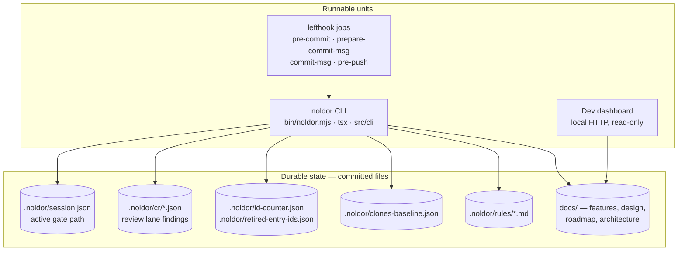

# Containers

Noldor has no server and no database. Its runnable units are a CLI, a set of git
hook jobs that shell into that CLI, and a local dashboard — and its durable
state is a directory of JSON and markdown files committed alongside the code.

## Runnable units

**The CLI** (`bin/noldor.mjs` → `src/cli/index.ts`) is the only entry point.
Every capability is a `noldor <group> <subcommand>` resolved through
`src/cli/manifest.ts`. It runs TypeScript directly through `tsx` rather than a
compiled bundle.

**The hook jobs** (`lefthook/noldor.yml`) are the enforcement surface. They run
the same CLI at four git stages: `pre-commit` formats, syncs link projections
and validates; `prepare-commit-msg` injects trailers from the session marker;
`commit-msg` checks scope and trailers; `pre-push` enforces the review receipt,
the commit-body contract, template parity and the clone ratchet.

**The dashboard** (`src/dashboard/`) is a read-only local web view of the same
files — a development convenience, never a source of truth.

## Durable state

**`.noldor/`** is the durable state. It is deliberately plain files: a session
marker naming the active gate path, review sinks per lane, an ID counter, the
retired-ID map, the clone baseline, rule definitions, and the runner logs and
state that the autonomous drain keeps.

## Topology

There is no deployment topology to draw: a release publishes the CLI as an npm
package, and a consumer installs it as a dev dependency.
