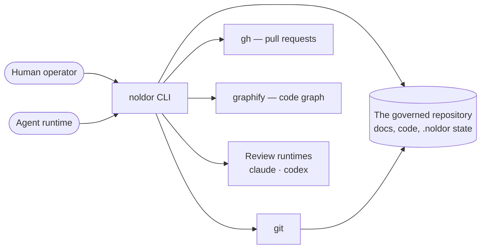

# Context

Noldor is a discipline framework for agent-driven development. It is not a
service: it runs on a developer machine or in CI, inside the repository it
governs, and every effect it has is a file written or a git operation performed
in that repository.

## Actors

Two kinds of actor drive it. A **human operator** invokes the gate and answers
its questions. An **agent** — Claude Code, codex or opencode — does the same
through the same entry points, which is why every prompt has a headless
equivalent and every check has an exit code.

## Externals

It depends on four externals it does not control: **git** for all history and
worktree operations, the **GitHub CLI** (`gh`) for pull requests and merges,
**graphify** for the code graph the freshness gate reads, and the **agent
runtimes** it dispatches for code review.

## Boundary

The boundary worth naming: Noldor never talks to a network service of its own.
Anything durable it produces is a committed file, so the whole system state is
readable with `git log` and a text editor.
