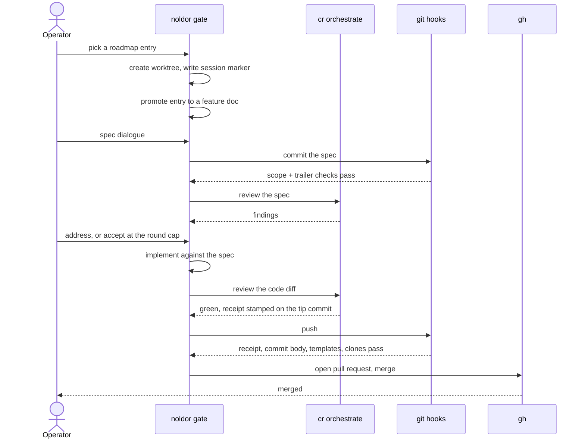
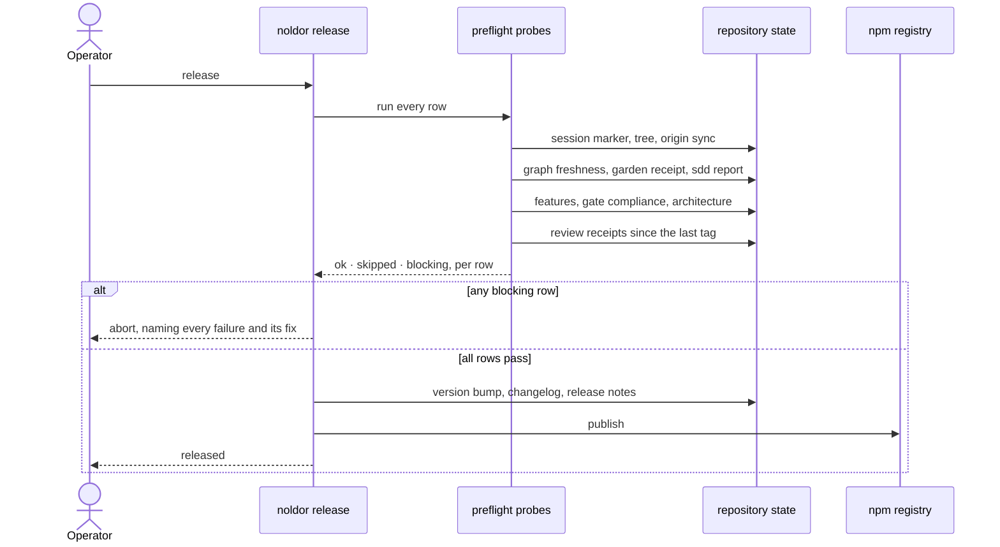

# Flows

Two flows carry the weight. The gate flow is how a change reaches `main`; the
release flow is how `main` reaches a version. Everything else in the framework
exists to serve one of them.

## The gate flow

An operator or agent picks work, the gate scaffolds artifacts, review runs at
each artifact stage, and the pull request merges only once the review receipt on
the commit tree is valid. The receipt is bound to `HEAD^{tree}`, so any later
edit invalidates it — that is what stops a reviewed change from being quietly
amended before it lands.

## The release flow

A release runs a preflight of independent probes before anything is published.
Each probe reports its own row rather than throwing, so one run names every
problem instead of stopping at the first.

