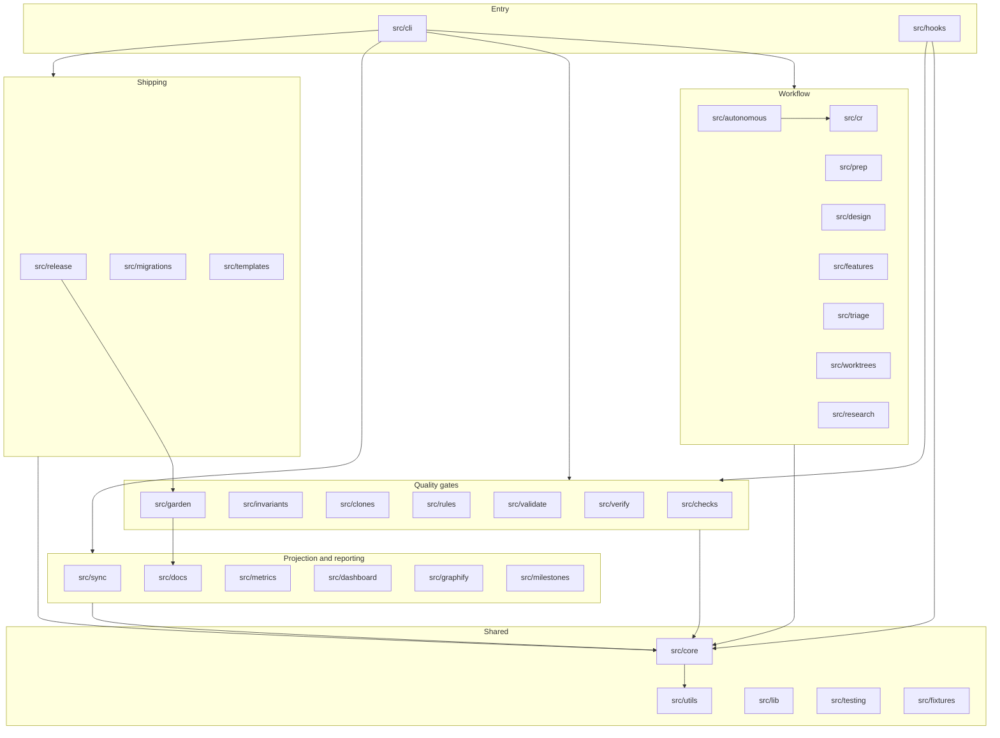

# Modules

Dependency direction runs one way: everything depends on `src/core`, and
`src/core` depends on nothing else in `src`. The workflow modules sit above it,
the enforcement surfaces sit above them, and no module below reaches back up.

## The diagram

## Who owns what durable state

| Module | Owns |
|---|---|
| `src/core` | `.noldor/session.json`, `.noldor/config.json`, doc-root resolution, atomic writes |
| `src/cr` | `.noldor/cr/*.json` review sinks, the auto-fix round ledger |
| `src/triage` | `.noldor/id-counter.json`, `.noldor/retired-entry-ids.json` |
| `src/clones` | `.noldor/clones-baseline.json` |
| `src/rules` | `.noldor/rules/*.md` |
| `src/design` | `.noldor/design/*.md` dialogue ledgers |
| `src/autonomous` | drain state, escalation inbox, watch state |
| `src/release` | release state and the garden receipt |
| `src/templates` | `templates/` and the scaffold-only set |
| `src/docs` | `docs/user/how-to/index.md`, `docs/architecture/` checking |
| `src/garden` | `docs/sdd-report.md` |

Modules with no durable state of their own — `src/checks`, `src/invariants`,
`src/validate`, `src/verify`, `src/sync`, `src/metrics`, `src/dashboard`,
`src/graphify`, `src/milestones`, `src/features`, `src/prep`, `src/research`,
`src/worktrees`, `src/hooks`, `src/cli`, `src/migrations`, `src/utils`,
`src/lib`, `src/testing`, `src/fixtures` — read what the owners above write.
That is deliberate: a single writer per file is what makes the concurrency rule
enforceable.
