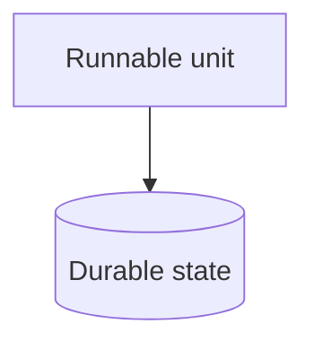
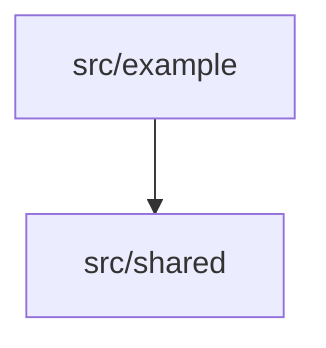
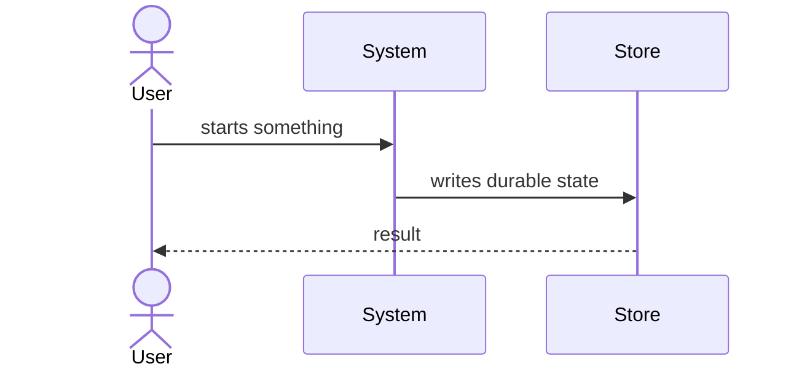

# Architecture Page Form Contract (Part 2: The Written Decline) Implementation Plan

> **For agentic workers:** Execute this plan task-by-task inline — read each task, use your normal file-edit and shell tools, follow the TDD step order exactly, commit at each task's Commit step, tick `- [ ] → - [x]` as you go. Do not delegate execution to a sub-skill or separate executor.

**Goal:** A page can decline a registry section in writing, so an un-annotated gap stays distinguishable from a deliberate one — and the templates teach both the sections and the marker.
**Architecture:** `architecture-form.ts` gains cut parsing and folds declines into `assessPageForm`; the advisory union gains an `unknown-cut` variant with an ordinal; the four scaffold-only templates gain the fidelity line, the section skeleton and non-`TODO:` prompts.
**Tech Stack:** TypeScript, vitest, `stripCodeRegions` (`src/docs/docs-check.ts`).

**Depends on:** part 1 (`…-page-form-contract-part1.md`) — `assessPageForm`, `ArchitectureAdvisory` and the per-variant garden discriminator must exist.

---

## File Structure

- `src/docs/architecture-form.ts` — MODIFY: `SECTION_CUT_TOKEN`, `parseSectionCuts`, and decline-aware `assessPageForm`.
- `src/docs/docs-architecture.ts` — MODIFY: `unknown-cut` advisory variant and its emission.
- `src/garden/detectors/architecture.ts` — MODIFY: `unknown-cut` discriminator, ordinal included.
- `templates/docs/architecture/context.md` — MODIFY: fidelity line, `## Actors` / `## Externals` / `## Boundary`, non-`TODO:` prompts.
- `templates/docs/architecture/containers.md` — MODIFY: fidelity line, `## Runnable units` / `## Durable state` / `## Topology`.
- `templates/docs/architecture/modules.md` — MODIFY: fidelity line, `## Dependency direction` / `## State ownership`.
- `templates/docs/architecture/flows.md` — MODIFY: fidelity line, two H2 stubs so a scaffolded page satisfies the sentinel.
- `src/docs/__tests__/architecture-form.test.ts` — MODIFY: cut parsing and decline suppression.
- `src/docs/__tests__/docs-architecture.test.ts` — MODIFY: `unknown-cut` emission.
- `src/garden/detectors/__tests__/architecture.test.ts` — MODIFY: ordinal-separated ids.

---

## Task 1: Cut-marker parsing

**Files:**
- Modify: `src/docs/architecture-form.ts`
- Test: `src/docs/__tests__/architecture-form.test.ts`

- [ ] **Step 1: Write the failing test.** Append to `src/docs/__tests__/architecture-form.test.ts`, extending its import to `import { SECTION_CUT_TOKEN, assessPageForm, parseSectionCuts } from '../architecture-form.js';`:

```ts
describe(parseSectionCuts, () => {
  it('reads a well-formed marker', () => {
    const body = '<!-- noldor:cut-section Topology — single npm package, nothing to draw -->';
    expect(parseSectionCuts(body)).toStrictEqual([
      { name: 'Topology', reason: 'single npm package, nothing to draw', wellFormed: true },
    ]);
  });

  it('tolerates a "## " prefix on the name', () => {
    expect(parseSectionCuts('<!-- noldor:cut-section ## topology — none -->')[0]).toStrictEqual({
      name: 'topology',
      reason: 'none',
      wellFormed: true,
    });
  });

  it('treats a later em dash as part of the reason', () => {
    const body = '<!-- noldor:cut-section Topology — one unit — nothing to draw -->';
    expect(parseSectionCuts(body)[0]!.reason).toBe('one unit — nothing to draw');
  });

  it('marks a marker with no em dash as malformed', () => {
    expect(parseSectionCuts('<!-- noldor:cut-section Topology -->')[0]).toStrictEqual({
      name: 'Topology',
      reason: '',
      wellFormed: false,
    });
  });

  it('marks an empty reason as malformed', () => {
    expect(parseSectionCuts('<!-- noldor:cut-section Topology —    -->')[0]!.wellFormed).toBe(false);
  });

  it('ignores a marker inside a fenced block', () => {
    const body = ['```markdown', '<!-- noldor:cut-section Topology — an example -->', '```'].join(
      '\n',
    );
    expect(parseSectionCuts(body)).toStrictEqual([]);
  });

  it('ignores a marker inside an inline code span', () => {
    const body = 'write `<!-- noldor:cut-section Topology — like this -->` on the page';
    expect(parseSectionCuts(body)).toStrictEqual([]);
  });

  it('ignores an ordinary noldor:cut ladder marker', () => {
    const body = '<!-- noldor:cut one diagram — split when the container count passes 12 -->';
    expect(parseSectionCuts(body)).toStrictEqual([]);
  });

  it('finds every marker in document order', () => {
    const body = [
      '<!-- noldor:cut-section Topology — a -->',
      'prose',
      '<!-- noldor:cut-section Boundary — b -->',
    ].join('\n');
    expect(parseSectionCuts(body).map((c) => c.name)).toStrictEqual(['Topology', 'Boundary']);
  });

  it('exports the token it parses', () => {
    expect(SECTION_CUT_TOKEN).toBe('noldor:cut-section');
  });
});
```

- [ ] **Step 2: Run to verify FAIL.**

```bash
pnpm vitest run src/docs/__tests__/architecture-form.test.ts -t parseSectionCuts
```

Expected output: the file fails to collect — `No "parseSectionCuts" export is defined on the module`.

- [ ] **Step 3: Implement.** Add to `src/docs/architecture-form.ts`, above `assessPageForm`, and extend its imports with `import { stripCodeRegions } from './docs-check.js';`:

```ts
/**
 * The marker that declines a registry section, deliberately NOT the bare
 * `noldor:cut`.
 *
 * `CUT_MARKER_TOKEN` in `src/cr/lanes/subagent-dispatch.ts` is
 * `noldor:cut <ceiling> — <upgrade path>`, pinned by a test against the rule
 * file, and its second field is an upgrade path rather than a reason. Sharing
 * the token would make an ordinary ladder cut written on an architecture page
 * parse as a section decline naming a non-section, and emit a bogus advisory —
 * the exact noise a written decline exists to remove.
 */
export const SECTION_CUT_TOKEN = 'noldor:cut-section';

/** One `noldor:cut-section` marker found on a page. */
export interface SectionCut {
  /** Name as written, minus any `## ` the author included. Compared case-insensitively. */
  readonly name: string;
  /** Everything after the first em dash, trimmed. Empty when malformed. */
  readonly reason: string;
  /**
   * A marker suppresses its section only when well-formed: it carries the em
   * dash and a reason of at least one non-whitespace character. The reason is
   * the entire point of requiring the marker, so a decline that silences a row
   * without recording why is the pure advisory this design rejected.
   */
  readonly wellFormed: boolean;
}

/** `<!-- noldor:cut-section <name> [— <reason>] -->`, non-greedy to the first `-->`. */
const CUT_RE = new RegExp(`<!--\\s*${SECTION_CUT_TOKEN}\\s+([\\s\\S]*?)-->`, 'g');

/**
 * Every section-cut marker on the page, in document order.
 *
 * Markers inside fenced blocks and inline code spans are skipped: the templates'
 * example prose contains one, and reading it as a real decline would silently
 * suppress a section advisory — the failure the unknown-cut rule exists to
 * prevent.
 *
 * noldor:cut backtick fences only — `stripCodeRegions` recognizes a literal
 * triple backtick and nothing else, matching the ceiling `fenceKinds` already
 * declares on this surface. Route marker matching through a fully fence-aware
 * scan if a consumer's pages adopt tilde fences.
 *
 * @param body - Raw markdown
 */
export function parseSectionCuts(body: string): SectionCut[] {
  const out: SectionCut[] = [];
  for (const match of stripCodeRegions(body).matchAll(CUT_RE)) {
    const inner = match[1]!;
    const dash = inner.indexOf('—');
    const rawName = (dash === -1 ? inner : inner.slice(0, dash)).trim();
    const reason = dash === -1 ? '' : inner.slice(dash + 1).trim();
    out.push({
      name: rawName.replace(/^#+\s*/, ''),
      reason,
      wellFormed: dash !== -1 && reason.length > 0,
    });
  }
  return out;
}
```

The regex requires whitespace after the token, so `noldor:cut one diagram — …` cannot match `noldor:cut-section`: the literal is `noldor:cut-section` followed by `\s+`, and the ladder marker has a space where the hyphen would be.

- [ ] **Step 4: Run to verify PASS.**

```bash
pnpm vitest run src/docs/__tests__/architecture-form.test.ts -t parseSectionCuts
```

Expected output: `10 passed`.

- [ ] **Step 5: Commit.**

```bash
cat > /tmp/arch-form-p2t1.msg <<'EOF'
feat(docs:consumer-architecture-doc-surface): parse section-decline markers

Why — the section advisory shipped in part 1 prints the same row for a page that
has never heard of a section and one whose author decided it does not apply. The
list becomes noise the moment a page has a legitimate omission, and noise is
what makes an advisory ignorable.

How — a page declines a section in writing with
`<!-- noldor:cut-section <name> — <reason> -->`. The token is deliberately not
the bare `noldor:cut`: that one is pinned by a test with an upgrade path as its
second field, so sharing it would make an ordinary ladder cut on an architecture
page parse as a decline naming a non-section. A marker suppresses its section
only when it carries the dash and a non-empty reason, because the reason is the
whole point of requiring it.

What — `SECTION_CUT_TOKEN`, the `SectionCut` shape, and `parseSectionCuts`,
which skips markers inside fences and code spans so the templates' own examples
do not read as declines.

Noldor-FD: consumer-architecture-doc-surface
EOF
git add src/docs/architecture-form.ts src/docs/__tests__/architecture-form.test.ts
git commit -F /tmp/arch-form-p2t1.msg
```

---

## Task 2: Declines suppress, malformed and unknown are reported

**Files:**
- Modify: `src/docs/architecture-form.ts`
- Test: `src/docs/__tests__/architecture-form.test.ts`

- [ ] **Step 1: Write the failing test.** Append to `src/docs/__tests__/architecture-form.test.ts`:

```ts
describe('assessPageForm declines', () => {
  it('a well-formed cut suppresses its section', () => {
    const body = '## Actors\n## Externals\n<!-- noldor:cut-section Boundary — nothing to say -->';
    const got = assessPageForm(CONTEXT, body);
    expect(got.missing).toStrictEqual([]);
    expect(got.unknownCuts).toStrictEqual([]);
  });

  it('matches the declined name case-insensitively', () => {
    const body = '## Actors\n## Externals\n<!-- noldor:cut-section boundary — none -->';
    expect(assessPageForm(CONTEXT, body).missing).toStrictEqual([]);
  });

  it('a malformed cut does not suppress, and is reported', () => {
    const body = '## Actors\n## Externals\n<!-- noldor:cut-section Boundary -->';
    const got = assessPageForm(CONTEXT, body);
    expect(got.missing).toStrictEqual(['Boundary']);
    expect(got.unknownCuts).toStrictEqual([{ name: 'Boundary', ordinal: 0 }]);
  });

  it('a cut naming a non-section is reported, with an ordinal per occurrence', () => {
    const body =
      '## Actors\n## Externals\n## Boundary\n' +
      '<!-- noldor:cut-section Nope — a -->\n<!-- noldor:cut-section Nope — b -->';
    expect(assessPageForm(CONTEXT, body).unknownCuts).toStrictEqual([
      { name: 'Nope', ordinal: 0 },
      { name: 'Nope', ordinal: 1 },
    ]);
  });

  it('a cut for a section that is also present is not an unknown cut', () => {
    const body = '## Actors\n## Externals\n## Boundary\n<!-- noldor:cut-section Boundary — x -->';
    expect(assessPageForm(CONTEXT, body).unknownCuts).toStrictEqual([]);
  });

  it('never reports an unknown cut on an empty-sections page', () => {
    const body = '## A flow\n<!-- noldor:cut-section Anything — no set to check against -->';
    expect(assessPageForm(FLOWS, body).unknownCuts).toStrictEqual([]);
  });
});
```

- [ ] **Step 2: Run to verify FAIL.**

```bash
pnpm vitest run src/docs/__tests__/architecture-form.test.ts -t 'assessPageForm declines'
```

Expected output: six failures, each `expected undefined to strictly equal []` or similar — `PageForm` has no `unknownCuts` yet.

- [ ] **Step 3: Implement.** In `src/docs/architecture-form.ts`, add the `UnknownCut` interface above `PageForm`, add the field to `PageForm`, and replace the body of `assessPageForm`:

```ts
/** A cut marker that names nothing in the page's registry set, or that carries no reason. */
export interface UnknownCut {
  readonly name: string;
  /** 0-based position among this page's unknown cuts — two identical markers are two rows. */
  readonly ordinal: number;
}
```

`PageForm` gains:

```ts
  /** Cuts that name no registry section, or that carry no reason. */
  readonly unknownCuts: readonly UnknownCut[];
```

and `assessPageForm` becomes:

```ts
export function assessPageForm(page: FormPage, body: string): PageForm {
  // The `flows` sentinel: no set to check names against, so a cut here cannot be
  // a typo, and firing would make every possible decline on the page a row.
  if (page.sections.length === 0) {
    return { missing: [], unknownCuts: [], flowHeadings: h2s(body).length };
  }

  const present = new Set(h2s(body).map(norm));
  const known = new Set(page.sections.map(norm));
  const declined = new Set<string>();
  const unknownCuts: UnknownCut[] = [];

  for (const cut of parseSectionCuts(body)) {
    if (cut.wellFormed && known.has(norm(cut.name))) {
      declined.add(norm(cut.name));
      continue;
    }
    unknownCuts.push({ name: cut.name, ordinal: unknownCuts.length });
  }

  const missing = page.sections.filter((s) => !present.has(norm(s)) && !declined.has(norm(s)));
  return { missing, unknownCuts, flowHeadings: null };
}
```

- [ ] **Step 4: Fix part 1's tests for the new field.** Part 1's `assessPageForm` cases assert `toStrictEqual({ missing: [], flowHeadings: null })`. Add `unknownCuts: []` to every such literal in the file.

- [ ] **Step 5: Run to verify PASS.**

```bash
pnpm vitest run src/docs/__tests__/architecture-form.test.ts
```

Expected output: `24 passed` (8 from part 1, 10 from Task 1, 6 here).

- [ ] **Step 6: Commit.**

```bash
cat > /tmp/arch-form-p2t2.msg <<'EOF'
feat(docs:consumer-architecture-doc-surface): honour section declines

A well-formed cut naming one of the page's registry sections suppresses that
section's row, so a deliberate omission stops printing as a gap. A cut that
names something else, or that carries no reason, does not suppress — it is
reported instead, because a typo'd decline would otherwise silence nothing while
looking to its author like it did.

Unknown cuts carry an ordinal so two identical markers on one page stay two
rows. A page whose `sections` is empty reports none: it has no set to check a
name against, so no marker on it can be a typo.

Noldor-FD: consumer-architecture-doc-surface
EOF
git add src/docs/architecture-form.ts src/docs/__tests__/architecture-form.test.ts
git commit -F /tmp/arch-form-p2t2.msg
```

---

## Task 3: Emit the unknown-cut advisory

**Files:**
- Modify: `src/docs/docs-architecture.ts`, `src/garden/detectors/architecture.ts`
- Test: `src/docs/__tests__/docs-architecture.test.ts`, `src/garden/detectors/__tests__/architecture.test.ts`

- [ ] **Step 1: Write the failing tests.** Append to `src/docs/__tests__/docs-architecture.test.ts`:

```ts
describe('unknown-cut advisory', () => {
  it('reports a cut that names no section, and honours a valid one', async () => {
    const root = await makeRepo();
    const context =
      '# Context\n\n## Actors\n\na\n\n## Externals\n\nb\n' +
      '<!-- noldor:cut-section Boundary — nothing to say -->\n' +
      '<!-- noldor:cut-section Nope — not a section -->\n' +
      '\n```mermaid\nflowchart LR\n  a --> b\n```\n';
    await writeArchitecture(root, {
      context,
      containers: fullPage('containers'),
      modules: fullPage('modules'),
      flows: fullPage('flows'),
    });
    const report = await checkArchitecture(root);
    expect(report.advisories.filter((a) => a.kind === 'section')).toStrictEqual([]);
    expect(report.advisories.filter((a) => a.kind === 'unknown-cut')).toMatchObject([
      { pageId: 'context', section: 'Nope', ordinal: 0 },
    ]);
    expect(report.status).toBe('ok');
  });
});
```

and to `src/garden/detectors/__tests__/architecture.test.ts`, adding two rows to the `report` factory's `advisories` array:

```ts
    {
      kind: 'unknown-cut',
      pageId: 'context',
      page: 'docs/architecture/context.md',
      section: 'Nope',
      ordinal: 0,
      message: 'docs/architecture/context.md declines "Nope"',
    },
    {
      kind: 'unknown-cut',
      pageId: 'context',
      page: 'docs/architecture/context.md',
      section: 'Nope',
      ordinal: 1,
      message: 'docs/architecture/context.md declines "Nope"',
    },
```

plus a case:

```ts
  it('separates two identical unknown cuts on one page', () => {
    const ids = toAdvisoryGaps(report())
      .map((g) => g.itemId)
      .filter((id) => id.includes('unknown-cut'));
    expect(ids).toStrictEqual([
      'docs/architecture/context.md#unknown-cut:Nope:0',
      'docs/architecture/context.md#unknown-cut:Nope:1',
    ]);
  });
```

- [ ] **Step 2: Run to verify FAIL.**

```bash
pnpm vitest run src/docs/__tests__/docs-architecture.test.ts src/garden/detectors/__tests__/architecture.test.ts
```

Expected output: the `unknown-cut advisory` case fails with `expected [] to match object [ { pageId: 'context', ... } ]`, and the garden file fails to typecheck the new rows because the union has no `unknown-cut` member.

- [ ] **Step 3: Add the union variant.** In `src/docs/docs-architecture.ts`, add to `ArchitectureAdvisory`, after the `section` member:

```ts
  | (AdvisoryBase & {
      readonly kind: 'unknown-cut';
      readonly section: string;
      readonly ordinal: number;
    })
```

- [ ] **Step 4: Emit it.** In `collectFormAdvisories`, after the `form.missing` loop, insert:

```ts
    for (const cut of form.unknownCuts) {
      out.push({
        kind: 'unknown-cut',
        pageId: page.id,
        page: label,
        section: cut.name,
        ordinal: cut.ordinal,
        message:
          `${label} declines "${cut.name}", which is not one of its sections or carries no ` +
          `reason — a decline reads \`${SECTION_CUT_TOKEN} <section> — <reason>\`.`,
      });
    }
```

and extend the module's import to `import { SECTION_CUT_TOKEN, assessPageForm } from './architecture-form.js';`.

- [ ] **Step 5: Point the section message at the marker.** In the same function, the `section` row's message becomes:

```ts
        message:
          `${label} does not name section "${section}" — add a \`## ${section}\` heading, ` +
          `or record why it does not apply with a ${SECTION_CUT_TOKEN} marker.`,
```

This is the propagation mechanism: existing consumers get no migration, so the advisory message is the only place the new contract reaches them.

- [ ] **Step 6: Add the garden discriminator.** In `src/garden/detectors/architecture.ts`, add to `advisoryDiscriminator`'s switch, before `flow-headings`:

```ts
    case 'unknown-cut':
      return `unknown-cut:${advisory.section}:${advisory.ordinal}`;
```

- [ ] **Step 7: Run to verify PASS.**

```bash
pnpm typecheck && pnpm vitest run src/docs src/garden src/release
```

Expected output: typecheck clean; every test passing. `src/release` is in the run because the `architecture` preflight row reads `status`, which no advisory reaches — this is what proves it stayed that way.

- [ ] **Step 8: Commit.**

```bash
cat > /tmp/arch-form-p2t3.msg <<'EOF'
feat(docs:consumer-architecture-doc-surface): report malformed and unknown declines

`checkArchitecture` now emits an `unknown-cut` row for a marker that names no
registry section or carries no reason, and the section message names the marker
that would decline it — which is the whole propagation mechanism, since the four
pages are scaffold-only and an existing consumer never receives a changed
template.

The garden discriminator includes the ordinal, so two identical markers on one
page stay two gaps instead of collapsing into one.

Noldor-FD: consumer-architecture-doc-surface
EOF
git add src/docs/docs-architecture.ts src/garden/detectors/architecture.ts src/docs/__tests__/docs-architecture.test.ts src/garden/detectors/__tests__/architecture.test.ts
git commit -F /tmp/arch-form-p2t3.msg
```

---

## Task 4: Templates carry the skeleton

**Files:**
- Modify: `templates/docs/architecture/context.md`, `templates/docs/architecture/containers.md`, `templates/docs/architecture/modules.md`, `templates/docs/architecture/flows.md`

- [ ] **Step 1: Rewrite `templates/docs/architecture/context.md`.**

```markdown
# Context

The system, its actors, and the externals it talks to — and only that. Runnable
units belong on `containers.md`; internal structure belongs on `modules.md`.

<!-- TODO: draw the real context diagram, fill in the sections, and delete this line -->


## Actors

<!-- what belongs here: who drives this system — people and other systems. One line each. -->

## Externals

<!-- what belongs here: what it depends on and does not control. One line each. -->

## Boundary

<!-- what belongs here: what this system deliberately does not do or own. -->
```

- [ ] **Step 2: Rewrite `templates/docs/architecture/containers.md`.**

```markdown
# Containers

Runnable units and what they own — and only that. Internal dependency direction
belongs on `modules.md`. A repo with no backend still has an answer here: its
runnable units are whatever it ships.

<!-- TODO: draw the real container diagram, fill in the sections, and delete this line -->



## Runnable units

<!-- what belongs here: each deployable or runnable thing, one line each. -->

## Durable state

<!-- what belongs here: each store, and which unit owns it. -->

## Topology

<!-- what belongs here: what runs where. "One npm package, nothing to deploy" is a real answer.
     If the section does not apply at all, decline it with a section-cut marker rather than
     deleting the heading — `noldor docs architecture --check` prints the exact syntax. -->
```

- [ ] **Step 3: Rewrite `templates/docs/architecture/modules.md`.**

```markdown
# Modules

Internal dependency direction and state ownership — and only that. Runnable
units belong on `containers.md`; runtime sequences belong on `flows.md`.

Name every module directory here. `noldor docs architecture --check` reports an
advisory for any module the code has that this page never names — it matches on
the path (`src/core`, `packages/api`), so use real paths in the diagram.

<!-- TODO: draw the real module diagram, fill in the sections, and delete this line -->



## Dependency direction

<!-- what belongs here: which way imports point, and which module depends on nothing. -->

## State ownership

<!-- what belongs here: which module writes which durable file or store. A table works well. -->
```

- [ ] **Step 4: Rewrite `templates/docs/architecture/flows.md`.** This page has no fixed section set — its headings name its flows — so the template ships two stubs, which is what keeps a freshly scaffolded page from tripping the one-heading rule.

```markdown
# Flows

The two or three load-bearing runtime flows, end to end — and only those. Not
every flow; the ones whose sequence a new maintainer has to know before changing
anything. Static structure belongs on `modules.md`.

Give each flow its own `## ` heading.

<!-- TODO: draw the real flow diagrams, name the real flows, and delete this line -->

## First flow

<!-- what belongs here: what starts it, what it touches in order, how it ends. -->



## Second flow

<!-- what belongs here: the same, for the next load-bearing flow. Delete this section if there is only one. -->
```

- [ ] **Step 5: Verify exactly one placeholder marker per template.**

```bash
for f in templates/docs/architecture/*.md; do
  echo "$f: $(grep -c '<!-- TODO:' "$f")"
done
```

Expected output: four lines, each ending `: 1`. The per-heading prompts read `<!-- what belongs here:` precisely so they do not collide with `PLACEHOLDER_MARKER` — a prompt carrying the `TODO:` prefix would send an author who wrote real prose but left the prompts in place to a **blocking**-red release.

- [ ] **Step 6: Verify a scaffolded surface still reads as absent.**

```bash
pnpm vitest run src/docs && pnpm noldor doctor
```

Expected output: tests pass; `doctor` reports no drift. These four files are in `SCAFFOLD_ONLY_TEMPLATES`, so template-sync does not require a consumer twin — `doctor` going red here means one of them left that set.

- [ ] **Step 7: Verify no template ships a parseable decline.** A `noldor:cut-section` example written into template prose would be a *real* decline: HTML comments do not nest, so an example inside a prompt comment still matches, and `stripCodeRegions` only blanks fences and code spans. A shipped marker would suppress that section's advisory for every consumer who scaffolds and never edits — the opposite of the intent, and silent.

```bash
pnpm tsx -e "
import { parseSectionCuts } from './src/docs/architecture-form.js';
import { readFileSync } from 'node:fs';
for (const f of ['context','containers','modules','flows']) {
  const found = parseSectionCuts(readFileSync(\`templates/docs/architecture/\${f}.md\`,'utf8'));
  console.log(f, found.length);
}
"
```

Expected output: four lines, each ending ` 0`. A non-zero count means a template spells the marker literally — describe it in prose instead, as Step 2's `## Topology` prompt does.

- [ ] **Step 8: Commit.**

```bash
cat > /tmp/arch-form-p2t4.msg <<'EOF'
feat(templates): give the architecture pages their section skeleton

Each template now states the C4 level it answers and where the adjacent level
belongs, then carries its registry sections as H2s with a one-line prompt under
each. `flows.md` ships two heading stubs, since its sections name its flows and
a scaffolded page with none would trip the one-heading rule on day one.

The prompts read `<!-- what belongs here:` rather than `<!-- TODO:`. That prefix
is the blocking placeholder marker, so a prompt using it would red the release
of any author who wrote real prose but left the prompts in place. Each page
keeps exactly one TODO marker — the single opt-in signal the surface depends on.

No template spells a literal section-cut marker: an example in shipped prose is
a real decline, which would silence the very advisory the page is teaching.

Noldor-FD: consumer-architecture-doc-surface
EOF
git add templates/docs/architecture
git commit -F /tmp/arch-form-p2t4.msg
```
