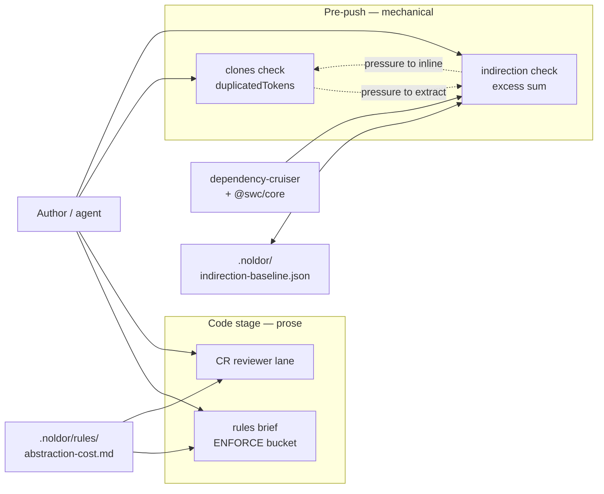

## Summary

A counterweight to the clone ratchet. `noldor indirection` measures how many
files a reader or agent must fetch to understand each module — the transitive
in-repo import closure — and ratchets the excess above a threshold of 30, so
cross-file indirection is priced the way duplication already is. The paired
`abstraction-cost` rule states when abstraction is warranted, binding at code
stage and resolved into the reviewer prompt.

## Diagram

The two mechanical gates pull against each other on purpose: the clone ratchet
reds when duplication grows, this one reds when cross-file indirection grows, and
a change that clears one by worsening the other no longer passes unnoticed. The
prose rule covers the same ground at code stage, where a reviewer can weigh
intent that neither counter can see.

## User Story

As an engineer or agent changing code in a Noldor repo, I want the framework to
price cross-file indirection the way it already prices duplication, so that
clearing the clone gate cannot quietly push me into an abstraction that costs
more than the duplication it removed.

## Usage

**CLI**

1. `pnpm noldor indirection report` — prints the excess sum, the closure
   percentiles (p50/p75/p90/p99/max) and one row per flagged module, sorted by
   closure descending.
2. `pnpm noldor indirection check` — compares the excess sum against
   `.noldor/indirection-baseline.json`. Exit 0 clean, 1 when the number rose,
   3 when the gate could not run (no parser, unresolved relative import,
   unreadable baseline).
3. `pnpm noldor indirection baseline` — records the current number, naming the
   direction of the change. Run this when a rise is deliberate, and commit the
   baseline alongside the change that caused it.

`check` runs automatically as the `noldor-indirection` pre-push job, and is
replayed author-side by `pnpm noldor checks push-gates` before the code-stage
review earns its receipt.

**Keyboard shortcut**

_none — CLI and pre-push hook only._

**Agent/Programmatic API**

- The `abstraction-cost` rule reaches an author via
  `pnpm noldor rules brief --file <path> --stage code`, listed under `ENFORCE`,
  and reaches the reviewer through the `enforce` bucket resolved for the
  changed files.

## PRs

<!-- @prs-since-last-release: abstraction-cost-ratchet -->

## Changelog
