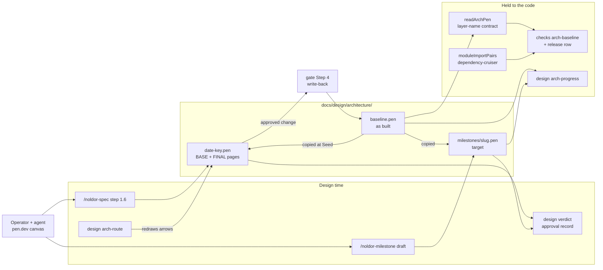

## Summary

An as-built architecture baseline on the pen.dev canvas — `docs/design/architecture/baseline.pen`, one page per `docs/architecture/` view — that architecture designs start from and ship back into, the loop UI designs already run. `checks arch-baseline` holds its `modules` view to the code: every module boxed once, every arrow backed by a real import. `/noldor-spec` step 1.6 seeds, iterates and approves an architecture `.pen`, gate Step 4 writes the approved change back, and a milestone can carry a target architecture whose gap `design arch-progress` reports — all on the approval, guard, archive and bridge machinery UI uses, through one design-kind seam (ADR 0007).

## Diagram

The baseline is the one as-built picture. A session copies it, draws its change on `FINAL:` pages and gets them approved; gate Step 4 writes the change back into the baseline, and `checks arch-baseline` (run by release preflight too) holds the baseline's modules and arrows to the real imports. A milestone target is copied the same way, and `design arch-progress` reports how far the baseline still is from it.

## User Story

As an operator designing a new milestone, feature or package, I want an as-built architecture canvas I can copy, redraw and approve beside the spec — written back when the code ships and checked against the real imports — so that architecture decisions start from a current picture and the picture stays true.

## Usage

**UI**

1. Bootstrap once: emit `docs/design/architecture/baseline.pen` from data, one top-level page per view — `context`, `containers`, `modules`, `flows` — naming each module box by its path (`src/cr`, or `src/a + src/b` for a box that covers two), each group frame `group: <Name>`, and each arrow `<from> -> <to>`. Run `pnpm noldor checks arch-baseline` until it is green, then tidy the layout in VS Code (pen.dev extension).
2. Design a feature or package: in a `specs-only-*` / `full-*` session, `/noldor-spec` step 1.6 asks whether the change is architectural. On `required` it copies the baseline to `docs/design/architecture/<date>-<key>.pen` with pages `BASE:<view>: as-built`. Draw variants as `<view>: <name>` pages, mark each winner `FINAL:<view>: <name>`, and approve at step 7.5.
3. Design a milestone: `/noldor-milestone draft` (or `edit`) offers to sketch a target into `docs/design/architecture/milestones/<slug>.pen`, linked from the milestone's `## Architecture target` section. The milestone file, the target and its approval record commit together through micro-chore.
4. After dragging boxes, ask the agent to fix the arrows — it runs `design arch-route` and passes the snippet to pencil `execute`. Save first if you drew new arrows.
5. At ship, gate Step 4 writes the approved change into the baseline and runs the check.

**Agent/Programmatic API**

- `pnpm noldor checks arch-baseline` — holds the baseline's `modules` view to the code. `missing-module`, `unknown-module`, `duplicate-module`, `phantom-edge`, `dangling-edge` and `unreadable` exit 1; `undrawn-edge` is advisory; no baseline reports `absent` and exits 0. Release preflight runs it as the `arch-baseline` row (`RELEASE_SKIP_ARCH_BASELINE=1` overrides).
- `pnpm -s noldor design arch-route --pen <path> [--view <view>]` — prints a pencil `execute` snippet that redraws every named arrow from its boxes' live bounds; exit 1 when no arrow resolves, 2 on bad arguments.
- `pnpm noldor design arch-progress --milestone <slug>` — per view a milestone target covers, lists its `to-build` and `to-remove` items and a `done` count against the baseline; exit 0 whatever the gap, 1 when a file cannot be read, 2 on a bad slug.
- `pnpm noldor design verdict --pen <architecture .pen> --approve --surface <view>… (--spec <spec> | --milestone <slug>) --editor-page <name>…` — records the approval under `.noldor/design-approval/architecture/` (`architecture/milestones/` for a milestone target); `--check`, `--reconfirm` and `--waive` work as for UI.
- `pnpm noldor design archive` and `pnpm noldor design pen-bridge` — treat architecture designs like UI ones: the archive moves the session's architecture `.pen` into `archive/` and repoints `links.arch`, and the bridge ranks live designs of either kind first.
- `readArchPen(text)` (`src/design/arch-pen.ts`) — the pure reader behind all of the above.
- `moduleImportPairs(cwd, roots, modules)` (`src/indirection/module-pairs.ts`) — module-to-module import pairs from dependency-cruiser, or `unmeasurable` when the graph cannot be built.

## PRs

<!-- @prs-since-last-release: architecture-design-phase -->

## Changelog

<!-- generated: resources -->

## Resources

- **Spec:** [`docs/design/specs/archive/2026-09-24-architecture-design-phase-design.md`](../../docs/design/specs/archive/2026-09-24-architecture-design-phase-design.md)
- **Code:**
  - [`src/checks/check-arch-baseline.ts`](../../src/checks/check-arch-baseline.ts)
  - [`src/design/arch-baseline.ts`](../../src/design/arch-baseline.ts)
  - [`src/design/arch-check.ts`](../../src/design/arch-check.ts)
  - [`src/design/arch-pen.ts`](../../src/design/arch-pen.ts)
  - [`src/design/arch-progress.ts`](../../src/design/arch-progress.ts)
  - [`src/design/arch-route.ts`](../../src/design/arch-route.ts)
  - [`src/indirection/module-pairs.ts`](../../src/indirection/module-pairs.ts)
- **Tests:**
  - [`src/checks/__tests__/check-arch-baseline.test.ts`](../../src/checks/__tests__/check-arch-baseline.test.ts)
  - [`src/core/__tests__/allowlist.test.ts`](../../src/core/__tests__/allowlist.test.ts)
  - [`src/core/__tests__/feature-schema.test.ts`](../../src/core/__tests__/feature-schema.test.ts)
  - [`src/core/__tests__/session.test.ts`](../../src/core/__tests__/session.test.ts)
  - [`src/design/__tests__/arch-check.test.ts`](../../src/design/__tests__/arch-check.test.ts)
  - [`src/design/__tests__/arch-pen.test.ts`](../../src/design/__tests__/arch-pen.test.ts)
  - [`src/design/__tests__/arch-progress.test.ts`](../../src/design/__tests__/arch-progress.test.ts)
  - [`src/design/__tests__/arch-route.test.ts`](../../src/design/__tests__/arch-route.test.ts)
  - [`src/design/__tests__/archive-cli.test.ts`](../../src/design/__tests__/archive-cli.test.ts)
  - [`src/design/__tests__/archive-resolve.test.ts`](../../src/design/__tests__/archive-resolve.test.ts)
  - [`src/design/__tests__/design-approval.test.ts`](../../src/design/__tests__/design-approval.test.ts)
  - [`src/design/__tests__/pen-bridge.test.ts`](../../src/design/__tests__/pen-bridge.test.ts)
  - [`src/indirection/__tests__/module-pairs.test.ts`](../../src/indirection/__tests__/module-pairs.test.ts)
  - [`src/indirection/__tests__/trees/modules/src/b/y.spec.ts`](../../src/indirection/__tests__/trees/modules/src/b/y.spec.ts)
  - [`src/sync/__tests__/sync-fd-resources.test.ts`](../../src/sync/__tests__/sync-fd-resources.test.ts)

<!-- /generated: resources -->
