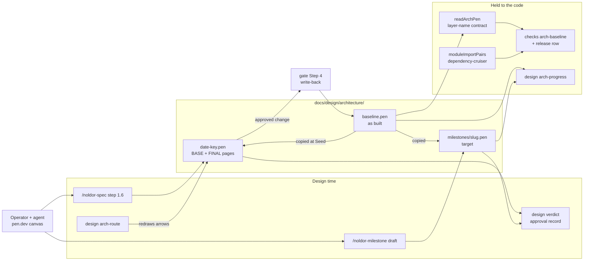

## Summary

An as-built architecture canvas on pen.dev — `docs/design/architecture/baseline.pen`, one detailed `architecture` page drawn between C4 containers and components: externals, containers and stores, modules, and parts inside modules — that architecture designs start from and ship back into, the loop UI designs already run. `design arch-draw` draws the first canvas from the code and adds new modules later, and [`docs/noldor/architecture-canvas.md`](../noldor/architecture-canvas.md) tells any agent how to finish and keep it. `checks arch-baseline` holds it to the code: every module boxed once, every part real and inside its module, every arrow between code paths backed by a real import; arrows to the outer layers are held to resolving. `/noldor-spec` step 1.6 seeds, iterates and approves an architecture `.pen`, gate Step 4 writes the approved change back, and a milestone can carry a target architecture whose gap `design arch-progress` reports — all on the approval, guard, archive and bridge machinery UI uses, through one design-kind seam (ADR 0007, narrowed to one page by ADR 0010).

## Diagram

```mermaid
flowchart LR
  op["Operator + agent<br/>pen.dev canvas"]

  subgraph files["docs/design/architecture/"]
    base["baseline.pen<br/>as built"]
    sess["date-key.pen<br/>BASE + FINAL pages"]
    target["milestones/slug.pen<br/>target"]
  end

  subgraph design["Design time"]
    spec["/noldor-spec step 1.6"]
    ms["/noldor-milestone draft"]
    route["design arch-route"]
    verdict["design verdict<br/>approval record"]
  end

  subgraph truth["Held to the code"]
    reader["readArchPen<br/>layer-name contract"]
    pairs["moduleImportPairs<br/>dependency-cruiser"]
    check["checks arch-baseline<br/>+ release row"]
    progress["design arch-progress"]
  end

  gate["gate Step 4<br/>write-back"]

  op --> spec
  op --> ms
  base -->|"copied at Seed"| sess
  base -->|"copied"| target
  spec --> sess
  ms --> target
  route -->|"redraws arrows"| sess
  sess --> verdict
  target --> verdict
  sess -->|"approved change"| gate
  gate --> base
  base --> reader
  reader --> check
  pairs --> check
  base --> progress
  target --> progress
```

The baseline is the one as-built picture. A session copies it, draws its change on `FINAL:` pages and gets them approved; gate Step 4 writes the change back into the baseline, and `checks arch-baseline` (run by release preflight too) holds the baseline's modules and arrows to the real imports. A milestone target is copied the same way, and `design arch-progress` reports how far the baseline still is from it.

## User Story

As an operator designing a new milestone, feature or package, I want an as-built architecture canvas I can copy, redraw and approve beside the spec — written back when the code ships and checked against the real imports — so that architecture decisions start from a current picture and the picture stays true.

## Usage

**UI**

1. Bootstrap once: `pnpm noldor design arch-draw` writes `docs/design/architecture/baseline.pen` with every module in `group: Unplaced` and its sub-folders as parts. Then follow [`docs/noldor/architecture-canvas.md`](../noldor/architecture-canvas.md) in VS Code (pen.dev extension): place the modules into containers and groups, add externals, stores and key parts, draw the arrows that matter, and run `pnpm noldor checks arch-baseline` until it is green.
2. Design a feature or package: in a `specs-only-*` / `full-*` session, `/noldor-spec` step 1.6 asks whether the change is architectural. On `required` it copies the baseline to `docs/design/architecture/<date>-<key>.pen` with one `BASE:architecture: as-built` page. Draw variants as `architecture: <name>` pages, mark the winner `FINAL:architecture: <name>`, and approve at step 7.5.
3. Design a milestone: `/noldor-milestone draft` (or `edit`) offers to sketch a target into `docs/design/architecture/milestones/<slug>.pen`, linked from the milestone's `## Architecture target` section. The milestone file, the target and its approval record commit together through micro-chore.
4. After dragging boxes, ask the agent to fix the arrows — it runs `design arch-route` and passes the snippet to pencil `execute`. Save first if you drew new arrows.
5. At ship, gate Step 4 writes the approved change into the baseline and runs the check. A `missing-module` finding is repaired with `pnpm noldor design arch-draw --refresh`, headless too.

**Agent/Programmatic API**

- `pnpm noldor checks arch-baseline` — holds the baseline to the code. `missing-module`, `unknown-module`, `duplicate-module`, `unknown-part`, `misplaced-part`, `phantom-edge`, `dangling-edge` and `unreadable` exit 1; `undrawn-edge` is advisory; no baseline reports `absent` and exits 0. Release preflight runs it as the `arch-baseline` row (`RELEASE_SKIP_ARCH_BASELINE=1` overrides).
- `pnpm noldor design arch-draw [--refresh]` — draws the first baseline from the code (exit 1 when one exists), or adds a box for each uncovered module without moving anything (exit 1 when none is readable); exit 2 on bad arguments.
- `pnpm -s noldor design arch-route --pen <path>` — prints a pencil `execute` snippet that redraws every named arrow from its boxes' live bounds; exit 1 when no arrow resolves, 2 on bad arguments.
- `pnpm noldor design arch-progress --milestone <slug>` — lists the target's `to-build` and `to-remove` items and a `done` count against the baseline; exit 0 whatever the gap, 1 when a file cannot be read, 2 on a bad slug.
- `pnpm noldor design verdict --pen <architecture .pen> --approve --surface architecture (--spec <spec> | --milestone <slug>) --editor-page <name>…` — records the approval under `.noldor/design-approval/architecture/` (`architecture/milestones/` for a milestone target); `--check`, `--reconfirm` and `--waive` work as for UI.
- `pnpm noldor design archive` and `pnpm noldor design pen-bridge` — treat architecture designs like UI ones.
- `readArchPen(text)` (`src/design/arch-pen.ts`) — the pure reader behind all of the above.
- `moduleImportPairs(cwd, roots, modules)` (`src/indirection/module-pairs.ts`) — module import pairs and in-repo file edges from one dependency-cruiser pass, or `unmeasurable` when the graph cannot be built.

## PRs

<!-- @prs-since-last-release: architecture-design-phase -->

## Changelog

<!-- generated: resources -->

## Resources

- **Spec:** [`docs/design/specs/archive/2026-09-24-architecture-design-phase-design.md`](../../docs/design/specs/archive/2026-09-24-architecture-design-phase-design.md)
- **Code:**
  - [`src/checks/check-arch-baseline.ts`](../../src/checks/check-arch-baseline.ts)
  - [`src/design/arch-baseline.ts`](../../src/design/arch-baseline.ts)
  - [`src/design/arch-check.ts`](../../src/design/arch-check.ts)
  - [`src/design/arch-pen.ts`](../../src/design/arch-pen.ts)
  - [`src/design/arch-progress.ts`](../../src/design/arch-progress.ts)
  - [`src/design/arch-route.ts`](../../src/design/arch-route.ts)
  - [`src/indirection/module-pairs.ts`](../../src/indirection/module-pairs.ts)
- **Tests:**
  - [`src/checks/__tests__/check-arch-baseline.test.ts`](../../src/checks/__tests__/check-arch-baseline.test.ts)
  - [`src/core/__tests__/allowlist.test.ts`](../../src/core/__tests__/allowlist.test.ts)
  - [`src/core/__tests__/atomic-write.test.ts`](../../src/core/__tests__/atomic-write.test.ts)
  - [`src/core/__tests__/feature-schema.test.ts`](../../src/core/__tests__/feature-schema.test.ts)
  - [`src/core/__tests__/session.test.ts`](../../src/core/__tests__/session.test.ts)
  - [`src/design/__tests__/arch-check.test.ts`](../../src/design/__tests__/arch-check.test.ts)
  - [`src/design/__tests__/arch-draw.test.ts`](../../src/design/__tests__/arch-draw.test.ts)
  - [`src/design/__tests__/arch-pen.test.ts`](../../src/design/__tests__/arch-pen.test.ts)
  - [`src/design/__tests__/arch-progress.test.ts`](../../src/design/__tests__/arch-progress.test.ts)
  - [`src/design/__tests__/arch-route.test.ts`](../../src/design/__tests__/arch-route.test.ts)
  - [`src/design/__tests__/archive-cli.test.ts`](../../src/design/__tests__/archive-cli.test.ts)
  - [`src/design/__tests__/archive-resolve.test.ts`](../../src/design/__tests__/archive-resolve.test.ts)
  - [`src/design/__tests__/design-approval.test.ts`](../../src/design/__tests__/design-approval.test.ts)
  - [`src/design/__tests__/pen-bridge.test.ts`](../../src/design/__tests__/pen-bridge.test.ts)
  - [`src/indirection/__tests__/module-pairs.test.ts`](../../src/indirection/__tests__/module-pairs.test.ts)
  - [`src/indirection/__tests__/trees/modules/src/b/y.spec.ts`](../../src/indirection/__tests__/trees/modules/src/b/y.spec.ts)
  - [`src/sync/__tests__/sync-fd-resources.test.ts`](../../src/sync/__tests__/sync-fd-resources.test.ts)

<!-- /generated: resources -->
