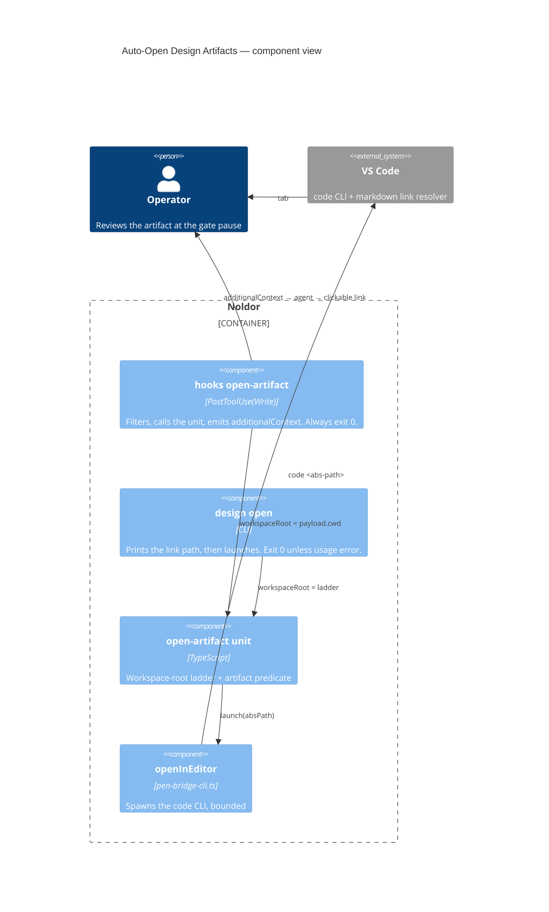

## Summary

A newly written spec or plan opens itself as a VS Code tab, and every artifact path the
framework reports resolves from the editor's workspace folder instead of the session's repo
root — so the operator ratifies a document they have actually had open, and the link they
are handed is never a dead one.

## Diagram



Two entry points, one decision unit. The hook is the Claude wiring and supplies the
workspace root from the payload's `cwd`; the CLI is what codex and opencode call and
resolves that root through a fallback ladder. Both delegate the launch to the same
`openInEditor` the pencil bridge uses, and neither can fail in a way that blocks a gate
step — the hook always exits 0, and the CLI prints the path even when no editor launches.

## User Story

As an operator reviewing a spec at the gate's approval pause, I want the artifact to open
in a VS Code tab the moment it is written and every reported path to be clickable from my
workspace, so that I ratify a document I have actually read instead of one summarised to
me in chat.

## Usage

Automatic in a Claude Code session: writing a spec or plan under a specs or plans doc root
opens it as a VS Code tab and hands the agent the path to report. No operator action.

By hand, or from a codex/opencode session:

```
pnpm noldor design open docs/design/specs/2026-09-02-my-feature-design.md
```

Prints the workspace-root-relative path to report as a markdown link, then opens the
artifact. Exit 0 even when `code` is absent — the path is printed and a remediation warning
goes to stderr. Exit 2 with a named reason when the path is not a live design artifact (a
`.md` direct child of a specs or plans doc root) or is not on disk. `--workspace-root
<abs-path>` overrides the resolved root for a layout the ladder guesses wrong, such as a
multi-root workspace.

## PRs

<!-- @prs-since-last-release: auto-open-design-artifacts -->

## Changelog
