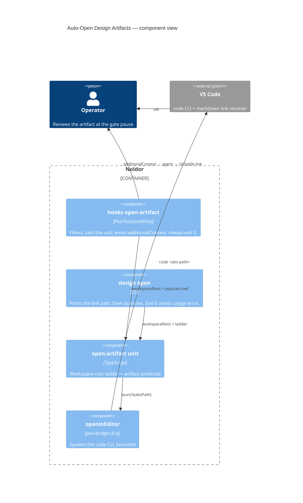

## Summary

Every artifact path the framework reports resolves from the editor's workspace folder
instead of the session's repo root, so the link the operator is handed is never a dead one.
Opening the artifact as a VS Code tab rides along, opt-in via `design.autoOpen` — a launch
cannot be made non-disruptive, so it is the operator's call rather than the default.

## Diagram



Two entry points, one decision unit. The hook is the Claude wiring and supplies the
workspace root from the payload's `cwd`; the CLI is what codex and opencode call and
resolves that root through a fallback ladder. Reporting the link is unconditional; the
launch is gated on `design.autoOpen` and, when it happens, delegates to the same
`openInEditor` the pencil bridge uses. Neither entry point can fail in a way that blocks a
gate step — the hook always exits 0, and the CLI prints the path even when no editor
launches.

## User Story

As an operator reviewing a spec at the gate's approval pause, I want the artifact to open
every reported path to be clickable from my workspace — and the tab to open only when I
have asked for it — so that I ratify a document I can actually reach in one click without
having a window yanked out from under me mid-task.

## Usage

Automatic in a Claude Code session: writing a spec or plan under a specs or plans doc root
hands the agent a ready-to-paste markdown link that resolves from the editor's workspace.
No operator action.

The tab is **off by default**. Opt in per repo:

```json
{ "design": { "autoOpen": true } }
```

Why off: macOS `open -g` keeps the *application* backgrounded, but when the artifact belongs
to a different editor **window** than the one you are in, the editor raises that window
itself — and nothing outside the editor can stop it (`code` has no preserve-focus flag, and
per-window IPC sockets exist only for integrated terminals). One click beats an interrupted
train of thought, so the link is unconditional and the tab is not.

By hand, or from a codex/opencode session:

```
pnpm noldor design open docs/design/specs/2026-09-02-my-feature-design.md
```

Prints the workspace-root-relative path to report as a markdown link, then opens the
artifact. Exit 0 even when `code` is absent — the path is printed and a remediation warning
goes to stderr. Exit 2 with a named reason when the path is not a live design artifact (a
`.md` direct child of a specs or plans doc root) or is not on disk. `--workspace-root
<abs-path>` overrides the resolved root for a layout the ladder guesses wrong, such as a
multi-root workspace.

## PRs

<!-- @prs-since-last-release: auto-open-design-artifacts -->

## Changelog

<!-- generated: resources -->

## Resources

- **Code:**
  - [`src/design/open-artifact-cli.ts`](../../src/design/open-artifact-cli.ts)
  - [`src/design/open-artifact.ts`](../../src/design/open-artifact.ts)
  - [`src/hooks/noldor-open-artifact.ts`](../../src/hooks/noldor-open-artifact.ts)
- **Tests:**
  - [`src/design/__tests__/editor-launch.test.ts`](../../src/design/__tests__/editor-launch.test.ts)
  - [`src/design/__tests__/open-artifact-cli.test.ts`](../../src/design/__tests__/open-artifact-cli.test.ts)
  - [`src/design/__tests__/open-artifact.test.ts`](../../src/design/__tests__/open-artifact.test.ts)
  - [`src/hooks/__tests__/noldor-open-artifact.test.ts`](../../src/hooks/__tests__/noldor-open-artifact.test.ts)

<!-- /generated: resources -->
