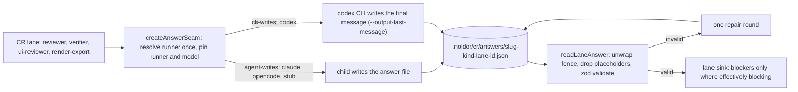

## Summary

Getting a green CR check is unreliable for reasons that have nothing to do with the code under review: a lane can approve a change and still red the round on how it wrote the answer down. Two confirmed mechanisms, both observed blocking a ship. **(1) The verify lane cannot report on a change whose evidence contains fenced code, because its own payload is a fence.** Shipping Q-0239 the verifier ran the full acceptance set twice and emitted `{"verdict":"pass"}` both times; `parseVerifyPayload` recovered neither, because the evidence quotes the ` ```bash ` blocks the change is about and the inner backticks close the outer fence early. The repair round failed identically, and `proseReportsSuccess` (`src/cr/lanes/verify.ts`) missed too — `PROSE_SUCCESS_RE` wants a `verifi*` stem or "all checks pass", which a verifier writing plainly never produces, while `PROSE_FAILURE_RE` vetoes on `\bmissing\b` / `\bwrong\b` / `\bcannot\b`, words that appear constantly in an honest description of what was tested. So the rescue valve is biased hard toward veto in exactly the rounds it exists to rescue, and the only exit was `Noldor-Path-Override`. **(2) A reviewer lane that writes `- (none)` under an empty severity bucket reds the round with phantom blockers.** Shipping Q-0246 the code-stage reviewer returned `summary: "approve"` yet its sink carried `[high]`/`[med]` blockers whose `message` was the literal string `(none)`; `cr aggregate` read `ok=false`, no receipt was minted, and `cr autofix plan` declined `no-mechanical` with nothing to apply. Candidate fixes: make the lane prompt demand a one-line machine verdict outside any fence (`NOLDOR-VERDICT: pass`) instead of pattern-matching free prose; have the extractor take the last balanced fence, or length-prefix the payload; drop a bullet whose text is empty or `(none)` (case-insensitive, parens optional); and stop `cr aggregate`'s `ok` from silently disagreeing with a lane's own `approve` summary. Deletion test: a change whose evidence contains fenced code, and a reviewer sink carrying `(none)` bullets, both produce the lane's real verdict. (found 2026-09-20 shipping Q-0239 / Q-0246)

## Diagram

Component view of one lane dispatch. The lane asks the answer seam for a verdict. The seam resolves the runner once and names a per-dispatch answer file. Either the child writes that file (claude, opencode, stub), or the codex CLI writes the child's final message there. The reader then unwraps a whole-file fence, drops placeholder entries and validates. One repair round retries an invalid answer before the lane writes its sink, where only effectively blocking findings become blockers.



## User Story

As an operator or agent shipping a change through the CR gate, I want each lane's real verdict to reach the aggregate however its answer quotes code or leaves a list empty, and a finding to block only when the lane would refuse the merge over it, so that a green review is never blocked by serialization or a nit and every red round names something worth stopping the merge for.

## Usage

**Agent/Programmatic API**

- `pnpm noldor cr orchestrate --slug <slug> --artifact <path> --kind <spec|plan|code>` works as before. Each agent lane (reviewer, verifier, ui-reviewer, render-export) now gets a per-dispatch answer path and returns its verdict as one JSON object in that file. A codex-mapped role has the file written by the codex CLI (`--output-last-message`) and keeps a read-only sandbox.
- `pnpm noldor cr aggregate --slug <slug> [--kind <kind>]` also works as before, but a reviewer blocker now appears only for a finding the reviewer marked `blocking` that is neither `minor` nor prefixed `maybe:` / `unverified:`. Every other finding sits in `suggestions`. The sink `summary` is derived from the findings (`approve` or `blockers found (N)`), and the reviewer's own one-line assessment is in `notes`. An answer that needed the one repair round says so in `notes`.
- `.noldor/cr/answers/<slug>-<kind>-<lane>.json` holds each lane's latest raw answer, for debugging a round.

## PRs

<!-- @prs-since-last-release: cr-lane-verdicts-blocked-by-serialization-not-substance -->

## Changelog
