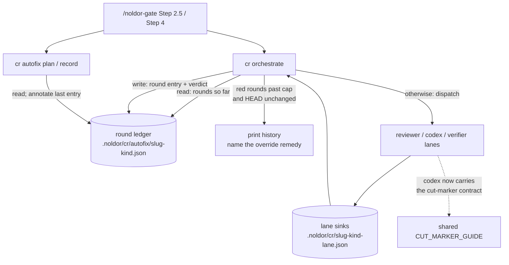

## Summary

Q-0130's re-round cap (2) is enforced in one half of the loop and asserted in the other. `AUTOFIX_ROUND_CAP` is a real bound on the auto-fix seam, but only `cr autofix record` writes the ledger it reads — an operator-driven round writes nothing, `cr orchestrate` has no round counter at all, and the combined bound is prose in a skill file. The cost is measurable: of 41 unique `Noldor-Path-Override` trailers in this repo's history, 23 name a CR round or convergence failure. The Q-0146 code CR ran 12 rounds, the reviewer finding one new med per round indefinitely while codex oscillated against its own round-4 demand and re-flagged documented `noldor:cut` sites five times.

This feature ships the enforcement half. `cr orchestrate` becomes the ledger's single writer, appending an entry for every round it resolves, and `cr autofix record` annotates the last entry instead of appending its own. The cap counts only the rounds that came back red, so the green finding-nothing dispatches a session runs to re-mint its `HEAD^{tree}`-bound receipt cost nothing. Past the cap orchestrate refuses to dispatch, printing the round history and the `Noldor-Path-Override` remedy; a commit that changes `HEAD` earns exactly one closing round, which mints the receipt if it comes back green. Separately it closes the codex cut-marker gap at its source: the codex prompt is built in `run-codex.ts` and carries no cut guide at all, so codex had never been told that a marked cut is a decision — which accounts for five of those twelve wasted rounds on its own.

The oscillation detector, locatable findings, the `noldor:cut` code-comment scanner and the machine-readable arbitration record are carved to **Q-0209** (`split-from: Q-0170`), which builds on this counter.

## Diagram

Component view of one code-review round. `cr orchestrate` gains a read of the round ledger before it dispatches and a write after the round resolves, taking over as its only writer; the ledger was previously written only by `cr autofix record`, which is why a round the seam did not run was invisible to the cap.



## User Story

As an agent or operator running code review through `/noldor-gate`, I want the re-round cap counted and enforced in code, and the codex lane told that a documented cut is a decision, so that a review loop stops at a budget it actually has instead of running twelve rounds and closing with a hand-typed override.

## Usage

Nothing new to invoke. `cr orchestrate` is called exactly as before and behaves identically while the round budget lasts.

```
pnpm noldor cr orchestrate --slug <slug> --artifact . --kind code --base-sha origin/main
```

Once red rounds exceed `AUTOFIX_ROUND_CAP` and `HEAD` is unchanged since the last one, the next call refuses instead of dispatching, exits 3, and prints the round history plus the remedy:

```
red rounds 3/3 for <slug> (code) — cap reached
  1  red    3 applied, 1 deferred  a1b2c3d
  2  red    2 applied, 0 deferred  e4f5g6h
  3  red    0 applied, 0 deferred  i7j8k9l
HEAD is unchanged since the last round, or the closing round is spent, so no
further round will be dispatched. To close: commit the remaining fixes and
re-review — that earns one closing round — or record the arbitration:
  git commit --amend --no-edit --trailer "Noldor-Path-Override: <why>"
```

Committing a fix and re-running spends the closing round. Green mints the receipt and the session ships; red is the last, and the override is the only exit after it.

## PRs

<!-- @prs-since-last-release: cr-re-round-cap-enforcement-and-oscillation-detector -->

## Changelog
