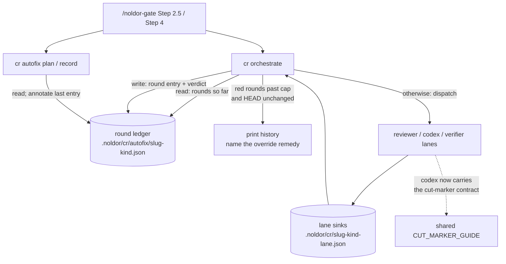

## Summary

Q-0130's re-round cap (2) is enforced in one half of the loop and asserted in the other. `AUTOFIX_ROUND_CAP` is a real bound on the auto-fix seam, but only `cr autofix record` writes the ledger it reads — an operator-driven round writes nothing, `cr orchestrate` has no round counter at all, and the combined bound is prose in a skill file. The cost is measurable: of 41 unique `Noldor-Path-Override` trailers in this repo's history, 23 name a CR round or convergence failure. The Q-0146 code CR ran 12 rounds, the reviewer finding one new med per round indefinitely while codex oscillated against its own round-4 demand and re-flagged documented `noldor:cut` sites five times.

This feature ships the enforcement half. `cr orchestrate` becomes the ledger's single writer, appending an entry for every round it resolves, and `cr autofix record` annotates the last entry instead of appending its own. The cap counts only the rounds that came back red, so the green finding-nothing dispatches a session runs to re-mint its `HEAD^{tree}`-bound receipt cost nothing. Past the cap orchestrate refuses to dispatch, printing the round history and the `Noldor-Path-Override` remedy; a commit that changes `HEAD` earns exactly one closing round, which mints the receipt if it comes back green. Separately it closes the codex cut-marker gap at its source: the codex prompt is built in `run-codex.ts` and carries no cut guide at all, so codex had never been told that a marked cut is a decision — which accounts for five of those twelve wasted rounds on its own.

The oscillation detector, locatable findings, the `noldor:cut` code-comment scanner and the machine-readable arbitration record are carved to **Q-0209** (`split-from: Q-0170`), which builds on this counter.

## Diagram

Component view of one code-review round. `cr orchestrate` gains a read of the round ledger before it dispatches and a write after the round resolves, taking over as its only writer; the ledger was previously written only by `cr autofix record`, which is why a round the seam did not run was invisible to the cap.



## User Story

As an agent or operator running code review through `/noldor-gate`, I want the re-round cap counted and enforced in code, and the codex lane told that a documented cut is a decision, so that a review loop stops at a budget it actually has instead of running twelve rounds and closing with a hand-typed override.

## Usage

Nothing new to invoke. `cr orchestrate` is called exactly as before.

```
pnpm noldor cr orchestrate --slug <slug> --artifact . --kind code --base-sha origin/main
```

Once red rounds exceed `AUTOFIX_ROUND_CAP` and `HEAD` is unchanged since the last one, the next call refuses instead of dispatching, exits 3, and prints the round history plus the remedy:

```
red rounds 3/3 for <slug> (code) — cap reached
  1  red    3 applied, 1 deferred  a1b2c3d
  2  red    2 applied, 0 deferred  e4f5g6h
  3  red    0 applied, 0 deferred  i7j8k9l
HEAD is unchanged since the last round, so nothing new has been written to
review. Two ways to close:
  Commit the remaining fixes and re-run this command — a changed HEAD past
  the cap earns exactly one closing round.
  Dispose of every blocker in the arbitration record below, then name its digest:
    git commit --amend --no-edit \
      --trailer "Noldor-Path-Override: cr-arbitration <digest> — <why>"
```

Committing a fix and re-running spends the closing round. Green mints the receipt and the session ships; red is the last.

After that the refusal is terminal, and the banner says so rather than repeating an offer no commit can take up — the closing round is gone, so arbitration is the only close:

```
The closing round for this series is already SPENT, so the cap is final: no
commit re-arms a dispatch and re-running this command will refuse again.
Arbitration is the only close.
```

Both banners name the `cr-arbitration <digest>` trailer form, not a bare `Noldor-Path-Override: <why>` — past the cap with the last round red, `decideArbitration` rejects the bare form outright, so advertising it sends the operator into a refused push.

On a re-round, `cr orchestrate` hands the `reviewer` and `codex` lanes their own prior blockers. The prompt lists them as `P1…Pn`, the lane answers each one in a `prior` list, and every prior not answered resolved comes back into the sink unchanged, so it keeps its fingerprint. A new finding blocks only as a regression the fix caused or under the blocking definition. The sink's `notes` record what happened to each prior:

```
prior P1 resolved: the check is gone
prior P2 still stands: still reads the old key
prior P3 unanswered — carried
```

If a reviewer or codex prior sink exists but cannot be read, does not parse, or fails the sink schema, the call refuses before dispatching anything and exits 4:

```
prior sink unusable — refusing the round, so no re-round runs without the blockers it held:
  <repo>/.noldor/cr/<slug>-<kind>-reviewer.json: <why>
Repair the file, or remove it to start that lane's series over (it then runs as a first round).
```

`pnpm noldor cr autofix plan --slug <slug> --kind <kind>` prints the rule for whoever writes the fix, above the blockers it lists:

```
fix-rule: make the smallest change that resolves the blocker, and prefer deleting a claim to adding one — a sentence, case or distinction the fix adds is surface the next round reviews
```

To rule on a blocker you are not fixing, at any round, record why:

```
pnpm noldor cr arbitration dispose --slug <slug> --kind <kind> \
  --blocker <id> --disposition rejected --note "<why>"
```

Run it without `--blocker` to list the standing reviewer and codex blockers and their ids. Before the round cap `--note` is required, and the command records nothing and exits 2 under `NOLDOR_DRAIN=1`, with no session marker, or when git cannot read the round's reviewed head. Later rounds of the session stop handing that finding to any lane as a prior while the lines it cites are unchanged. Both prior-aware lanes see every decided finding after their own priors:

```
S1 [fixed r2][high] the check is missing — added the check
S2 [rejected r1][med] rename the flag — the name is the public API
```

A lane that files a ruled finding again word for word gets it filed as a suggestion, with a note in its sink:

```
finding filed as a suggestion: it restates settled S2 (rejected), whose cited content is unchanged
```

When a code round then goes green, its receipt commit names each ruling of the session:

```
Noldor-CR-Settled: code rejected 1a2b3c4d5e6f — the fallback is intentional; see the cut marker
```

## PRs

<!-- @prs-since-last-release: cr-re-round-cap-enforcement-and-oscillation-detector -->

## Changelog

### 1.12.0

#### Summary

An operator's ruling on a CR finding now holds for the rest of the session (#495). Re-rounds now answer each prior blocker and re-file the ones that still stand (#493).

#### PRs

- #495: an operator's ruling on a CR finding holds for the rest of the session ([link](https://github.com/davidzoufaly/noldor/pull/495))
- #493: re-rounds answer each prior blocker and re-file the standing ones ([link](https://github.com/davidzoufaly/noldor/pull/493))

### Initial Release (v1.9.0)

#### Summary

This release adds `fingerprintBlocker` for single-finding identity (#434) and enforces the re-round cap in code while giving codex the cut contract (#431).

#### PRs

- #434: add fingerprintBlocker for single-finding identity ([link](https://github.com/davidzoufaly/noldor/pull/434))
- #431: enforce the re-round cap in code and give codex the cut contract ([link](https://github.com/davidzoufaly/noldor/pull/431))

<!-- generated: resources -->

## Resources

- **Code:**
  - [`src/cr/autofix-ledger.ts`](../../src/cr/autofix-ledger.ts)
  - [`src/cr/autofix.ts`](../../src/cr/autofix.ts)
  - [`src/cr/autofix-cli.ts`](../../src/cr/autofix-cli.ts)
  - [`src/cr/orchestrate.ts`](../../src/cr/orchestrate.ts)
  - [`src/cr/run-codex.ts`](../../src/cr/run-codex.ts)
  - [`src/cr/lanes/subagent-dispatch.ts`](../../src/cr/lanes/subagent-dispatch.ts)
  - [`src/core/structural-context-contract.ts`](../../src/core/structural-context-contract.ts)
  - [`src/cr/findings-schema.ts`](../../src/cr/findings-schema.ts)
  - [`src/cr/lanes/subagent.ts`](../../src/cr/lanes/subagent.ts)
  - [`src/cr/re-round.ts`](../../src/cr/re-round.ts)
  - [`src/cr/review-with-codex.ts`](../../src/cr/review-with-codex.ts)
  - [`src/cr/lanes/codex.ts`](../../src/cr/lanes/codex.ts)
  - [`src/cr/decisions.ts`](../../src/cr/decisions.ts)
  - [`src/cr/fingerprint.ts`](../../src/cr/fingerprint.ts)
  - [`src/cr/arbitration-cli.ts`](../../src/cr/arbitration-cli.ts)
  - [`src/cr/arbitration.ts`](../../src/cr/arbitration.ts)
  - [`src/cr/receipt-trailer.ts`](../../src/cr/receipt-trailer.ts)
- **Tests:**
  - [`src/cr/__tests__/amend-receipt.test.ts`](../../src/cr/__tests__/amend-receipt.test.ts)
  - [`src/cr/__tests__/arbitration-cli.test.ts`](../../src/cr/__tests__/arbitration-cli.test.ts)
  - [`src/cr/__tests__/autofix-cli.test.ts`](../../src/cr/__tests__/autofix-cli.test.ts)
  - [`src/cr/__tests__/autofix-ledger.test.ts`](../../src/cr/__tests__/autofix-ledger.test.ts)
  - [`src/cr/__tests__/decisions.test.ts`](../../src/cr/__tests__/decisions.test.ts)
  - [`src/cr/__tests__/lanes/codex.test.ts`](../../src/cr/__tests__/lanes/codex.test.ts)
  - [`src/cr/__tests__/lanes/subagent-dispatch.test.ts`](../../src/cr/__tests__/lanes/subagent-dispatch.test.ts)
  - [`src/cr/__tests__/lanes/subagent.test.ts`](../../src/cr/__tests__/lanes/subagent.test.ts)
  - [`src/cr/__tests__/orchestrate-decisions.test.ts`](../../src/cr/__tests__/orchestrate-decisions.test.ts)
  - [`src/cr/__tests__/orchestrate.test.ts`](../../src/cr/__tests__/orchestrate.test.ts)
  - [`src/cr/__tests__/prior-review.test.ts`](../../src/cr/__tests__/prior-review.test.ts)
  - [`src/cr/__tests__/re-round.test.ts`](../../src/cr/__tests__/re-round.test.ts)
  - [`src/cr/__tests__/run-codex.test.ts`](../../src/cr/__tests__/run-codex.test.ts)
  - [`src/cr/__tests__/settled-findings.integration.test.ts`](../../src/cr/__tests__/settled-findings.integration.test.ts)

<!-- /generated: resources -->
