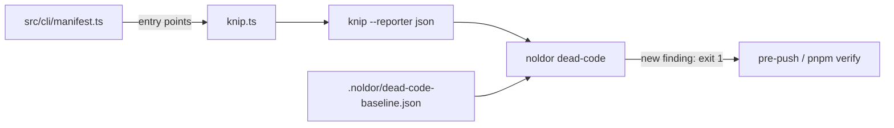

## Summary

Nothing in the framework finds dead code (unused files, unused exports, unused and unlisted dependencies). `noldor clones` finds code that exists twice, not code that should not exist; the `/noldor-refactor` report's "Dead Code" section is filled in by hand; the dashboard already looks for an "Unused Exports" count (`src/dashboard/data.ts:2125`) that nothing produces. This feature covers noldor itself: add knip as a devDependency, run it in pre-push or CI, and ratchet it like `clones` (a recorded baseline; the count may not rise). Consumers get the same check opt-in: it ships on every pre-push and stays off until `.noldor/config.json` sets `deadCode.enabled: true` (ADR 0011); with it on, `sdd-report` and the dashboard show the count.

## Diagram

`noldor dead-code` runs the repo-local knip with the root `knip.ts`, keys every finding, and compares the key set with the recorded baseline. `knip.ts` takes its CLI entry points from the command manifest, so string-loaded commands are not reported as dead.

## User Story

As a noldor maintainer (human or agent), I want a push to fail when my change leaves new dead code behind, so that the codebase stops collecting unused files, exports and dependencies.

## Usage

**Agent/Programmatic API**

- `pnpm noldor dead-code report` — list every knip finding, grouped by type (exit 0; 3 when knip cannot run).
- `pnpm noldor dead-code check` — off unless `.noldor/config.json` sets `"deadCode": { "enabled": true }`: then it prints one line and exits 0 without running knip. Turned on, it exits 1 and names each finding the baseline lacks, and 3 when the baseline is absent, unreadable, or recorded under another knip or algorithm version, or when the config is not readable. Runs on every pre-push (`lefthook/noldor.yml`, shipped to consumers) and in this repo's `pnpm verify`.
- `pnpm noldor dead-code baseline` — record the current findings to `.noldor/dead-code-baseline.json`, printing what was added and dropped — also when the old baseline was recorded under another knip or algorithm version, so a finding that lands alongside a knip bump is still named. `report` and `baseline` work with the check off, so a repo can set itself up before turning it on.
- A knip false positive is silenced in the repo's knip config with a one-line reason; real dead code is deleted or re-recorded, never ignored.
- `pnpm noldor upgrade` (1.16.0) adds `"deadCode": { "enabled": false }` to a consumer config that lacks it, and prints the steps to turn it on. It never turns the check on.
- With the check on, `pnpm noldor garden sdd-report` adds a `## Dead code` section (total, count outside the baseline, count per type), and the dashboard's graph-health page shows the recorded baseline count with its date.

Consumer setup: [adoption guide → Optional: dead-code check](../noldor/adoption-guide.md#optional-dead-code-check).

## PRs

<!-- @prs-since-last-release: dead-code-detection-with-knip -->

## Changelog

### Initial Release (v1.16.0)

#### Summary

This release adds a dead-code ratchet over knip findings (#679), along with an opt-in dead-code check for consumers (#681).

#### PRs

- #681: opt-in dead-code check for consumers ([link](https://github.com/davidzoufaly/noldor/pull/681))
- #679: dead-code ratchet over knip findings ([link](https://github.com/davidzoufaly/noldor/pull/679))

<!-- generated: resources -->

## Resources

- **Spec:** [`docs/design/specs/archive/2026-10-07-dead-code-detection-with-knip-design.md`](../../docs/design/specs/archive/2026-10-07-dead-code-detection-with-knip-design.md)
- **Code:**
  - [`src/checks/dead-code.ts`](../../src/checks/dead-code.ts)
- **Tests:**
  - [`src/checks/__tests__/dead-code.test.ts`](../../src/checks/__tests__/dead-code.test.ts)
  - [`src/dashboard/__tests__/dashboard-graph-health.test.ts`](../../src/dashboard/__tests__/dashboard-graph-health.test.ts)
  - [`src/garden/__tests__/sdd-report-dead-code.test.ts`](../../src/garden/__tests__/sdd-report-dead-code.test.ts)
  - [`src/migrations/__tests__/1.16.0.test.ts`](../../src/migrations/__tests__/1.16.0.test.ts)

<!-- /generated: resources -->
