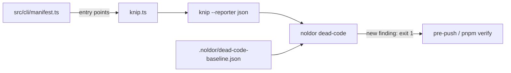

## Summary

Nothing in the framework finds dead code (unused files, unused exports, unused and unlisted dependencies). `noldor clones` finds code that exists twice, not code that should not exist; the `/noldor-refactor` report's "Dead Code" section is filled in by hand; the dashboard already looks for an "Unused Exports" count (`src/dashboard/data.ts:2125`) that nothing produces. This feature covers noldor itself: add knip as a devDependency, run it in pre-push or CI, and ratchet it like `clones` (a recorded baseline; the count may not rise). It ships nothing to consumers — the consumer-facing opt-in check is a separate roadmap entry, to follow once this one has proved itself.

## Diagram

`noldor dead-code` runs the repo-local knip with the root `knip.ts`, keys every finding, and compares the key set with the recorded baseline. `knip.ts` takes its CLI entry points from the command manifest, so string-loaded commands are not reported as dead.

## User Story

As a noldor maintainer (human or agent), I want a push to fail when my change leaves new dead code behind, so that the codebase stops collecting unused files, exports and dependencies.

## Usage

**Agent/Programmatic API**

- `pnpm noldor dead-code report` — list every knip finding, grouped by type (exit 0; 3 when knip cannot run).
- `pnpm noldor dead-code check` — exit 1 and name each finding the baseline lacks; exit 3 when the baseline is absent, unreadable, or recorded under another knip or algorithm version. Runs on pre-push (root `lefthook.yml`) and in `pnpm verify`, so CI runs it on every pull request.
- `pnpm noldor dead-code baseline` — record the current findings to `.noldor/dead-code-baseline.json`, printing what was added and dropped.
- A knip false positive is silenced in the root `knip.ts` as an entry or ignore with a one-line reason; real dead code is deleted or re-recorded, never ignored.

This repo only: nothing ships to consumers.

## PRs

<!-- @prs-since-last-release: dead-code-detection-with-knip -->

## Changelog

<!-- generated: resources -->

## Resources

- **Spec:** [`docs/design/specs/archive/2026-10-07-dead-code-detection-with-knip-design.md`](../../docs/design/specs/archive/2026-10-07-dead-code-detection-with-knip-design.md)
- **Code:**
  - [`src/checks/dead-code.ts`](../../src/checks/dead-code.ts)
- **Tests:**
  - [`src/checks/__tests__/dead-code.test.ts`](../../src/checks/__tests__/dead-code.test.ts)

<!-- /generated: resources -->
