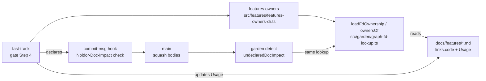

## Summary

A fast-track ships without attaching to any feature MD, so when one or more fast-tracks change the business logic, files, or behaviour an FD documents, that FD silently goes stale — the doc-tracked invariant holds only for paths that scaffold an artifact. Worth exploring whether fast-track should optionally attach to an FD the way the attach paths do (carrying the parent slug, refreshing the FD's Usage on ship), or whether a detector should flag an FD whose `links.code` paths moved under a fast-track commit it never records. The first is a gate change, the second a garden detector; they are not exclusive. (surfaced 2026-09-08)

## Diagram

A fast-track asks the owner lookup which done FDs own the files it changed, updates the Usage of any whose documented behaviour it altered, and records the answer as a `Noldor-Doc-Impact` trailer the commit-msg hook checks. After the squash merge, the garden detector walks `main` with the same lookup and names each FD whose code changed under a fast-track that recorded nothing.

## User Story

As an agent or operator shipping a fast-track, I want the gate to list the done feature docs that own the code I changed and to record whether I updated them, so that no fast-track quietly leaves a feature doc describing behaviour that no longer exists.

## Usage

**Agent/Programmatic API**

- `pnpm noldor features owners [--base <ref>] [--json]` — the FDs whose `links.code` owns a file changed since `<ref>` (default `origin/main`, three-dot diff), most owned files first. Each is a `candidate` (`phase: done` with a written `## Usage`) or skipped as `not-done` / `usage-unwritten`. Repeatable `--path <file>` asks about given files instead of the diff. Exit 0, also with no owners; 2 on a bad flag, `--base` with `--path`, an unresolvable ref, a git failure, or an FD whose frontmatter does not parse.
- Gate Step 4 on `fast-track` (interactive and drain) runs it before the push-gate preflight, updates the Usage of each candidate the change alters (`/noldor-draft-feature-md <slug> --refresh --scope <files> --usage-only`, `--yes` in a drain), and records `Noldor-Doc-Impact: <slug>, <slug>` on the FD-update commit, or amends `Noldor-Doc-Impact: none` onto the tip.
- The commit-msg hook refuses a `Noldor-Doc-Impact` value that is neither `none` alone nor slugs of existing `docs/features/<slug>.md` files, on every path.
- `pnpm noldor garden detect` → `undeclaredDocImpact`: one finding per candidate FD whose owned code changed in a first-parent fast-track commit with no declaration, after the oldest commit carrying one and after the FD's latest record. Advisory — it never blocks the garden receipt or a release.
- To clear a finding: update the FD's Usage, or, when it still holds, add `<!-- noldor:usage-checked <sha> -->` under its `## Usage` and commit it as `docs(features:<slug>): Usage checked against <sha>` through a micro-chore.

## PRs

<!-- @prs-since-last-release: fast-track-changes-can-obsolete-an-unattached-fd -->

## Changelog

<!-- generated: resources -->

## Resources

- **Spec:** [`docs/design/specs/archive/2026-09-25-fast-track-changes-can-obsolete-an-unattached-fd-design.md`](../../docs/design/specs/archive/2026-09-25-fast-track-changes-can-obsolete-an-unattached-fd-design.md)
- **Code:**
  - [`src/features/features-owners-cli.ts`](../../src/features/features-owners-cli.ts)
  - [`src/garden/detectors/undeclared-doc-impact.ts`](../../src/garden/detectors/undeclared-doc-impact.ts)
  - [`src/garden/graph-fd-lookup.ts`](../../src/garden/graph-fd-lookup.ts)
- **Tests:**
  - [`src/features/__tests__/features-owners-cli.test.ts`](../../src/features/__tests__/features-owners-cli.test.ts)
  - [`src/garden/__tests__/fd-ownership.test.ts`](../../src/garden/__tests__/fd-ownership.test.ts)
  - [`src/garden/detectors/__tests__/undeclared-doc-impact.test.ts`](../../src/garden/detectors/__tests__/undeclared-doc-impact.test.ts)
  - [`src/hooks/__tests__/noldor-validate-trailer.test.ts`](../../src/hooks/__tests__/noldor-validate-trailer.test.ts)

<!-- /generated: resources -->
