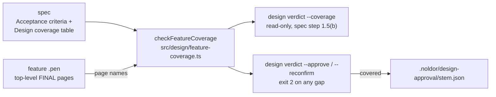

## Summary

The same coverage hole bites a *feature's* `.pen`, not only a baseline, and the one page-level rule is a count the agent executes by hand. The enforced set is existence (`no-design-artifact`, `ambiguous-design`), ratification (`design-unapproved`) and freshness (`pen-modified`); `noldor-spec` step 1.5(b) adds "exactly one `FINAL:` page per surface", which is prose and counts pages rather than asking what is in them. Shipping Q-0275 the first design drew only the happy path — rest, keyboard focus, empty scene, engine error, in-flight and the folded-bar layout were all missing until the operator asked where the interactions were, and three of those states are pinned by acceptance criteria. Wanted: the coverage set a feature `.pen` is held to is **derived from the spec's acceptance criteria**, not hand-written, and the verdict step checks against that list rather than a page count. It builds on the declared coverage set Q-0247 adds for baselines (split out of Q-0247 on 2026-09-25). `render-export-dispatch` / `render-compare` already export `.pen` pages to images, so a model-driven check can read them even where a static one cannot. (found 2026-09-22 shipping Q-0275)

## Diagram

The spec's coverage table and its acceptance criteria go into one pure check together with the design's page names. The read-only `--coverage` verb reports gaps before the operator is shown the pages; `--approve` and `--reconfirm` run the same check and write the approval record only when the design covers the table.

## User Story

As an operator approving a feature's UI design — or the agent taking that verdict for them — I want the design held to a list of pages derived from the spec's acceptance criteria, so that a design that draws only the happy path cannot be approved while states the criteria promise are still undrawn.

## Usage

**UI**

1. Write the spec's acceptance criteria as a numbered list, then add `### Design coverage` under `## Design`: a `| Page | Criteria | Shows |` table with one row per state the design must show, named `` `FINAL:<surface>: <state>` ``, citing the criteria it shows (`1, 4–6`, or `—` for a state a decision needs), plus at most one `not drawn` row for criteria with no screen of their own. Every criterion must appear on a row. `/noldor-spec` step 1.5 derives this table from the criteria before anything is drawn.
2. Draw the winning variant once per row, each a top-level `FINAL:<surface>: <state>` page named exactly as its row; a surface may own several. A page nested inside another frame does not count.
3. Before the pages are shown for approval (`/noldor-spec` verdict step (b)), the agent runs `design verdict --coverage` on the editor's page list; any gap sends it back to iterate.
4. Approve as before. `--approve` re-runs the check on the saved file and refuses a design that does not cover the table.

**Agent/Programmatic API**

- `pnpm noldor design verdict --pen <pen> --coverage --spec <spec> --editor-page "<name>" …` — read-only; judges the page names it is given, not the file, so it works before the editor saves. Exit 0 = the `FINAL:` pages are exactly the table's rows and every criterion has a row; 1 = every missing, doubled or undeclared page and every unaccounted criterion listed; 2 = usage error, unreadable spec, or an architecture design.
- `pnpm noldor design verdict --pen <pen> --approve …` — on a UI design, also exits 2 and writes nothing when the spec has no table or no criteria, a row is malformed, the criteria are misnumbered, a criterion is unaccounted for, or the pages differ from the table. Architecture designs, milestone targets and `--waive` are not checked.
- `pnpm noldor design verdict --pen <pen> --reconfirm` — also exits 2 when the changed spec is no longer covered by the approved pages, and says whether the table or the design must change.
- `checkFeatureCoverage(specMd, pageNames)` (`src/design/feature-coverage.ts`) — the pure check behind all three. `readCriteria(specMd)` (`src/core/spec-criteria.ts`) — the acceptance-criteria reader it shares with split-check's S2 counter.

## PRs

<!-- @prs-since-last-release: feature-pen-coverage-from-acceptance-criteria -->

## Changelog

<!-- generated: resources -->

## Resources

- **Spec:** [`docs/design/specs/archive/2026-09-25-feature-pen-coverage-from-acceptance-criteria-design.md`](../../docs/design/specs/archive/2026-09-25-feature-pen-coverage-from-acceptance-criteria-design.md)
- **Code:**
  - [`src/core/spec-criteria.ts`](../../src/core/spec-criteria.ts)
  - [`src/design/feature-coverage.ts`](../../src/design/feature-coverage.ts)
- **Tests:**
  - [`src/core/__tests__/spec-criteria.test.ts`](../../src/core/__tests__/spec-criteria.test.ts)
  - [`src/design/__tests__/design-approval.test.ts`](../../src/design/__tests__/design-approval.test.ts)
  - [`src/design/__tests__/feature-coverage.test.ts`](../../src/design/__tests__/feature-coverage.test.ts)

<!-- /generated: resources -->
