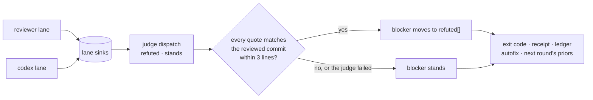

## Summary

Some blockers are simply wrong, and today nothing checks a claim before it turns a round red. In Charuy, 51 blockers (2.2%) contradicted the code they cited. 92% of them came from codex, and several were repeated across rounds: "announces its runId" kept coming back after a rebuttal (#179), and "upgrades unrelated dependencies" was filed although the base lockfile already had those versions (#126). In Noldor, codex's "placeholder classification can never succeed" was false five rounds in a row (#405). The panther claude-reviewer (gooddata/gdc-mastercard-panther `.github/claude-reviewer`) handles this with a judge: a cheap second model reads the diff plus the emitted findings and tries to refute each one with concrete contrary evidence. It drops only refuted findings and fails open, keeping everything when the result is inconclusive or the judge errors. Add the same pass after the lanes finish and before aggregate. A refuted blocker is demoted to a note that carries the judge's evidence, never silently dropped. Context leaks cause part of this class and may deserve their own fix. A framework-only rule vendored into a consumer's `.claude/engineering-rules.md` produced 27 Charuy blockers demanding a `templates/` twin in a repo that has none. Stale-base two-dot diffs caused others (#214, #109). Deletion test: a blocker whose cited line contradicts its claim is demoted, with the judge's evidence attached.

The two context-leak causes are carved out as their own entries: the framework-only rule leak to **Q-0264** and the stale-base two-dot diff to **Q-0265** (both `split-from: Q-0262`). This feature is the judge pass alone.

## Diagram

After the reviewer and codex lanes write their sinks, one judge dispatch answers `refuted` or `stands` for each of their blockers. Code moves a blocker into the sink's `refuted` list only when every quote the judge cites matches the committed file near the line it names. Everything else, including a judge that fails, leaves the blocker standing, and every reader of the round's verdict reads the sinks as the judge left them.

## User Story

As an operator or a drain child taking a change through the CR gate, I want a reviewer or codex blocker that the repository contradicts to be demoted, with evidence that code has checked against the reviewed commit, before it turns the round red, so that a wrong claim neither spends a round of the review budget nor gets "fixed" when nothing is wrong.

## Usage

**Agent/Programmatic API**

- `pnpm noldor cr orchestrate --slug <slug> --artifact <path> --kind <spec|plan|code>` — after the lanes settle, one judge dispatch tries to refute each `reviewer` and `codex` blocker, and stderr gets one line: `judge: refuted <k> of <n>`, `judge: skipped — …` or `judge: failed — every blocker stands (…)`. A blocker is demoted only when every quote in the judge's evidence (10+ non-whitespace characters) matches the named file at the reviewed commit within 3 lines of the cited line; every failure leaves the lanes' verdict as written.
- `pnpm noldor cr aggregate --slug <slug> --kind <kind>` — prints each demoted blocker after the standing ones as `refuted, not gating: [<sev>] <lane> <file>: <message> — judge: <why> (<file>:<line>)`. It never sets the exit code.
- A demoted blocker lives in its sink, `.noldor/cr/<slug>-<kind>-<lane>.json`, under `refuted: [{ finding, why, evidence: [{ file, line, quote }] }]`. The judge's latest raw answer is `.noldor/cr/answers/<slug>-<kind>-judge.json`.
- A green code round's receipt carries one `Noldor-CR-Refuted: <kind> <lane> <id12> — <why>` trailer per refutation of the session, beside `Noldor-Reviewed-Subagent`.
- `.noldor/config.json`: `crReview.judge: false` turns the judge off; `agents.roles.judge: { "runner": "<runner>", "model": "<model>" }` pins its runner and model.
- Tests: `setJudgeDispatcher(impl)` (`src/cr/judge.ts`) replaces the judge's child. An orchestrate test that files a reviewer or codex blocker installs one, or the judge spawns a real agent.

## PRs

<!-- @prs-since-last-release: refutation-judge-pass-before-a-blocker-can-red-a-round -->

## Changelog

### Initial Release (v1.12.0)

#### Summary

A blocker that contradicts the code it cites is now demoted before it can red a round (#497).

#### PRs

- #497: a blocker that contradicts the code it cites is demoted before it reds a round ([link](https://github.com/davidzoufaly/noldor/pull/497))

<!-- generated: resources -->

## Resources

- **Spec:** [`docs/design/specs/archive/2026-09-23-refutation-judge-pass-before-a-blocker-can-red-a-round-design.md`](../../docs/design/specs/archive/2026-09-23-refutation-judge-pass-before-a-blocker-can-red-a-round-design.md)
- **Code:**
  - [`src/cr/judge.ts`](../../src/cr/judge.ts)
  - [`src/cr/orchestrate.ts`](../../src/cr/orchestrate.ts)
  - [`src/cr/findings-schema.ts`](../../src/cr/findings-schema.ts)
  - [`src/cr/aggregate.ts`](../../src/cr/aggregate.ts)
  - [`src/cr/aggregate-cli.ts`](../../src/cr/aggregate-cli.ts)
  - [`src/cr/autofix-ledger.ts`](../../src/cr/autofix-ledger.ts)
  - [`src/cr/receipt-trailer.ts`](../../src/cr/receipt-trailer.ts)
  - [`src/cr/amend-receipt.ts`](../../src/cr/amend-receipt.ts)
  - [`src/core/agent-runner/types.ts`](../../src/core/agent-runner/types.ts)
  - [`src/core/config.ts`](../../src/core/config.ts)
- **Tests:**
  - [`src/cr/__tests__/aggregate.cli.test.ts`](../../src/cr/__tests__/aggregate.cli.test.ts)
  - [`src/cr/__tests__/judge.test.ts`](../../src/cr/__tests__/judge.test.ts)
  - [`src/cr/__tests__/orchestrate-judge.test.ts`](../../src/cr/__tests__/orchestrate-judge.test.ts)
  - [`src/templates/__tests__/shipped-rules-framework-free.test.ts`](../../src/templates/__tests__/shipped-rules-framework-free.test.ts)

<!-- /generated: resources -->
