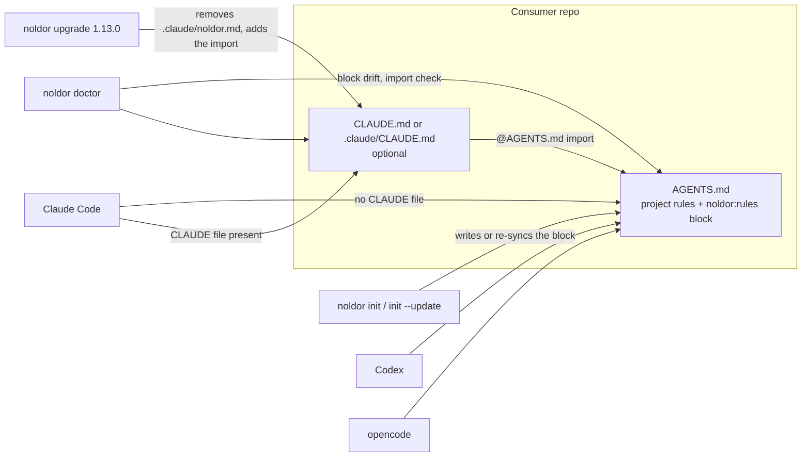

## Summary

Claude now reads `AGENTS.md`, which is the same file codex and opencode already read, so the framework no longer needs to scaffold a Claude-specific `CLAUDE.md` alongside it. Collapse the two onto one file: `noldor init` should write `AGENTS.md` and not create `CLAUDE.md` in a fresh consumer, and an existing consumer should get a migration path rather than a silently duplicated rule set — this repo itself runs the split today (`AGENTS.md` for codex/opencode, `.claude/` for Claude Code), and charuy carries the same duplication, so both need propagating. Adoption-weighted per the vision's standing tie-breaker: one agent-rules file is one less thing a new consumer has to understand, and a duplicated one is a drift source the moment the two copies disagree. Open questions for the spec: what happens to `.claude/skills/**`, which has no AGENTS.md equivalent and stays Claude-primary; and whether the migration rewrites an existing `CLAUDE.md` or leaves it and stops regenerating it. Deletion test: `noldor init` in a clean repo produces `AGENTS.md` and no `CLAUDE.md`, and a consumer that had both ends with one. (found 2026-09-22)

## Diagram

The framework writes one rules file, `AGENTS.md`, and owns only the block between its
`noldor:rules` markers. Codex and opencode read it directly. Claude Code reads it directly
when the repo has no CLAUDE file, and otherwise through the `AGENTS.md` import that
`noldor upgrade` adds and `noldor doctor` checks.

## User Story

As an adopter (human or agent) setting up Noldor in a repo, I want the framework to put its
rules in the one `AGENTS.md` that Claude Code, Codex and opencode all read — without
overwriting the `AGENTS.md` or `CLAUDE.md` I already have — so that every agent gets the same
rules from one place and there is no second copy to drift.

## Usage

**CLI**

1. `noldor init` writes `AGENTS.md` for every agent target, Claude included, and never
   writes a `CLAUDE.md`. In a repo that already has an `AGENTS.md`, it appends the
   framework's `noldor:rules` block and leaves every existing byte in place. Project rules go
   outside the markers.
2. `noldor init --update` re-syncs only that block; text outside it is never touched, and a
   file whose markers do not pair is refused with its path.
3. `noldor doctor` reports `AGENTS.md` only when the block is missing or differs. It fails
   with an `unwired  rules:` row when a `CLAUDE.md` or `.claude/CLAUDE.md` imports no
   `AGENTS.md` — Claude Code reads the CLAUDE file instead — and names the line to add:
   `@AGENTS.md` at the root, `@../AGENTS.md` in `.claude/`. A `CLAUDE.local.md` that hides
   `AGENTS.md` only warns, and `noldor init` prints the same finding without failing.
4. `noldor upgrade --dry-run`, then `noldor upgrade`, moves an older tree over (migration
   `1.13.0`): it removes an untouched `.claude/noldor.md`, repoints or adds the `AGENTS.md`
   import in a CLAUDE file (never a second one), and brings the `AGENTS.md` block current.
   The dry run lists exactly the steps the real run takes.

**Agent/Programmatic API**

- `checkAgentsMdWiring(cwd, targets)` (`src/checks/check-agents-md-wiring.ts`) — the wiring
  verdict `doctor` and `init` print; `agentsMdWiring(views)` is the same predicate over file
  contents.
- `planRegionSync(consumerDoc, templateDoc, rel)` (`src/templates/managed-region.ts`) —
  whether a region-managed file is unchanged, needs the block appended or replaced, or is
  malformed.

## PRs

<!-- @prs-since-last-release: scaffold-one-agent-rules-file-not-two -->

## Changelog

### Initial Release (v1.13.0)

#### Summary

AGENTS.md is now the one rules file for every agent. The framework owns only its marked block inside that file (#535).

#### PRs

- #535: AGENTS.md is the one rules file for every agent, and the framework owns only its marked block ([link](https://github.com/davidzoufaly/noldor/pull/535))

<!-- generated: resources -->

## Resources

- **Code:**
  - [`src/checks/check-agents-md-wiring.ts`](../../src/checks/check-agents-md-wiring.ts)
  - [`src/migrations/1.13.0.ts`](../../src/migrations/1.13.0.ts)
  - [`src/templates/managed-region.ts`](../../src/templates/managed-region.ts)
- **Tests:**
  - [`src/checks/__tests__/check-agents-md-wiring.test.ts`](../../src/checks/__tests__/check-agents-md-wiring.test.ts)
  - [`src/cli/__tests__/init-agents-md.test.ts`](../../src/cli/__tests__/init-agents-md.test.ts)
  - [`src/core/agent-runner/__tests__/runners.test.ts`](../../src/core/agent-runner/__tests__/runners.test.ts)
  - [`src/migrations/__tests__/1.13.0.test.ts`](../../src/migrations/__tests__/1.13.0.test.ts)
  - [`src/migrations/__tests__/chain.test.ts`](../../src/migrations/__tests__/chain.test.ts)
  - [`src/templates/__tests__/agent-filter.test.ts`](../../src/templates/__tests__/agent-filter.test.ts)
  - [`src/templates/__tests__/managed-region.test.ts`](../../src/templates/__tests__/managed-region.test.ts)
  - [`src/templates/__tests__/region-managed-sync.test.ts`](../../src/templates/__tests__/region-managed-sync.test.ts)
- **Docs:**
  - [`docs/noldor/adoption-guide.md`](../../docs/noldor/adoption-guide.md)
  - [`docs/noldor/agent-runtimes.md`](../../docs/noldor/agent-runtimes.md)

<!-- /generated: resources -->
