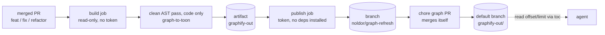

## Summary

The committed knowledge graph refreshes itself: a merged `feat`, `fix` or
`refactor` PR rebuilds `graphify-out/` on CI and lands it through a graph PR of
its own, so no feature PR carries the diff. The emitted `.toon` is v3 — about
two-thirds smaller (697 KB to about 235 KB on noldor's own 3,578-node graph),
addressed by community-local index, and fronted by a table of contents an agent
can `Read offset/limit` against.

## Diagram



No job pushes to the default branch: the only write to it is the merge of the
graph PR.

## User Story

As an agent reading a repo I did not write, I want the committed knowledge graph to be
fresh and to carry a table of contents, so that I can load one community's topology
instead of a 697 KB file — or, worse, reason from a graph that no longer matches the code.

## Usage

```bash
# Consumers get the workflow from init. It is scaffold-only, so your edits survive.
pnpm noldor init            # writes .github/workflows/update-knowledge-graph.yml
pnpm noldor init --update   # never overwrites an existing copy

# Locally nothing changes — the renderer just emits v3 now
pnpm noldor graphify graph-to-toon graphify-out/graph.json
```

On CI, a merged PR titled `feat`, `fix` or `refactor` regenerates `graphify-out/` onto the
fixed `noldor/graph-refresh` branch and opens one `chore(graph): …` PR, force-updated by
each later run — so the queue never grows past one. The PR merges itself: through
auto-merge where it is enabled, and by a direct squash-merge where it is not (a private
repo on GitHub's free plan, like charuy, cannot enable it). Only branch protection — a
required review or check — makes it wait for a human. Two repository settings the
template cannot set for you. GitHub Actions must be allowed to create pull requests
(Settings → Actions → General → Workflow permissions) — it is off by default, and while
it is off the run pushes the branch and then fails at `gh pr create`. And a PR opened with the default
`GITHUB_TOKEN` does not trigger other workflows, so required checks on the graph PR
need a PAT or app token.

Reading one community means taking its line range from the `toc` block at the top of
`graph.brainstorm.toon` and passing it as `Read offset/limit`:

```
# TOC: <key>: <startLine>-<endLine>
  c85: 1204-1231
```

**Agent/Programmatic API** — all in `src/graphify/graph-to-toon.ts`:

- `buildContext(data)` turns a parsed `graph.json` into the context both renderers read.
- `renderBrainstormToon(ctx)` and `renderBrainstormSummary(ctx)` return the two `.toon`
  texts without touching disk; the CLI reads the file, calls them, and writes the results.

## PRs

<!-- @prs-since-last-release: self-refreshing-compact-knowledge-graph -->

## Changelog

### Initial Release (v1.12.0)

#### Summary

This release ships a knowledge-graph refresh workflow (#501).

#### PRs

- #501: ship a knowledge-graph refresh workflow ([link](https://github.com/davidzoufaly/noldor/pull/501))

<!-- generated: resources -->

## Resources

- **Spec:** [`docs/design/specs/archive/2026-09-22-self-refreshing-compact-knowledge-graph-design.md`](../../docs/design/specs/archive/2026-09-22-self-refreshing-compact-knowledge-graph-design.md)
- **Code:**
  - [`.github/workflows/update-knowledge-graph.yml`](../../.github/workflows/update-knowledge-graph.yml)
  - [`src/graphify/graph-to-toon.ts`](../../src/graphify/graph-to-toon.ts)
  - [`src/templates/manifest.ts`](../../src/templates/manifest.ts)
  - [`templates/.github/workflows/update-knowledge-graph.yml`](../../templates/.github/workflows/update-knowledge-graph.yml)
- **Tests:**
  - [`src/graphify/__tests__/graph-to-toon.test.ts`](../../src/graphify/__tests__/graph-to-toon.test.ts)
  - [`src/templates/__tests__/templates.test.ts`](../../src/templates/__tests__/templates.test.ts)

<!-- /generated: resources -->
