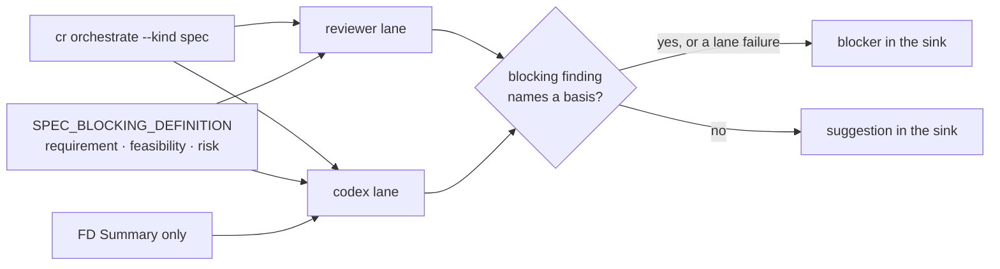

## Summary

Spec-stage review almost never ends green. In Charuy, spec stages ended green in 1 of 34 PRs, and no spec was ever green on round 1. In Noldor, 28 of 29 spec series since Aug 20 ended red, and no multi-round series converged. Blocker counts stay flat from round to round (15 → 15 → 14, 8 → 9 → 11) while specs grow (#148 went from 279 to 520 lines), so each round buys more surface for the next. Part of this comes from the prompt. The codex artifact prompt (`src/cr/run-codex.ts:126`) demands that "placeholder / TODO / unfilled content" be resolved, yet it is fed the FD, whose TODO stubs are filled after the spec by design; this produced repeated blockers on #148 and #113. Define what blocks at the spec stage: a missing or contradictory requirement, an infeasible design, or a risk the operator has not accepted. Wording, formatting, cross-references and FD TODO stubs never block, and FD stubs stop being fed as spec content. Consider a hard stop: after the second spec round, a finding can block only if it meets that definition and the operator has not already adjudicated it. Deletion test: a spec whose remaining findings are wording, formatting or FD-stub TODOs is green.

## Diagram

At kind spec both review lanes render the same three-basis definition, and codex reads only the FD's Summary. Each lane files a blocking finding as a blocker only when it names a basis. Anything else, apart from a lane's own failure, lands in the suggestions, so a round of wording or stub findings goes green.

## User Story

As an operator or agent taking a spec through the CR gate, I want a spec finding to block only when it names a missing or contradictory requirement, a design that cannot be built, or a risk the spec has not accepted, so that a spec whose remaining findings are wording, formatting or feature-MD stubs goes green instead of looping to the round cap.

## Usage

**Agent/Programmatic API**

- `pnpm noldor cr orchestrate --slug <slug> --artifact <spec> --kind spec` — the reviewer and codex lanes both render the spec-stage blocking definition. Each spec blocker carries a `basis` (`requirement`, `feasibility` or `risk`); a spec finding marked blocking without one is filed as a suggestion. A lane's own failure blocker (`<reviewer>`, `<codex>`) still blocks. At this kind codex reads only the FD's Summary.
- `pnpm noldor cr aggregate --slug <slug> --kind spec` — prints a spec blocker's basis beside its severity, e.g. `[high][risk] reviewer docs/design/specs/…: …`. Re-round prompts list priors the same way (`P1 [high][design][risk] …`).
- To settle a spec blocker without applying it, record the ruling in the spec: move the requirement to Non-goals, accept the risk under Risks / trade-offs, or answer the question under Open questions (resolved). The next round's lanes read it there.
- Codex's output schema (`src/cr/cr-record.schema.json`) requires `basis` on every finding: one of the three values, or `null` outside spec reviews.

## PRs

<!-- @prs-since-last-release: spec-stage-cr-stopping-rule -->

## Changelog
