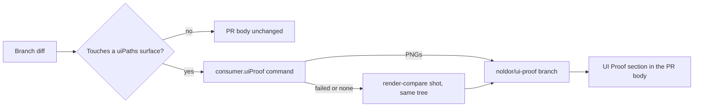

## Summary

When a feature touches UI, the PR should carry a screenshot of it working as proof — and when the feature is e2e-tested on the UI end, the screenshot comes from that run. Today a UI change ships with a text-only PR body, so a reviewer has to check out the branch to see the result. Capture screenshots from the e2e/verify run (or a dedicated capture step) and attach them to the PR body via `pr-flow`.

## Diagram

`pr-flow` matches the branch diff against the UI surfaces, picks a screenshot per surface (the consumer's proof command first, a fresh `render-compare` shot second), pushes the images to the orphan `noldor/ui-proof` branch, and links them from the PR body.

## User Story

As a reviewer of a consumer PR that changes UI (human or agent), I want the PR body to show screenshots of the change working, so that I can judge the result without checking out the branch.

## Usage

**Agent/Programmatic API**

- `pnpm noldor pr-flow` — when the branch diff touches a `consumer.uiPaths` surface, the PR body gains a `## UI Proof` section with up to 3 inline screenshots per surface. Nothing changes for a branch that touches no UI path.
- `consumer.uiProof.<surface>.command` (`.noldor/config.json`, optional `timeoutMs`, default 300000) — a proof command run at ship time into an emptied folder, passed as `{out}` and as `NOLDOR_PROOF_OUT`. Example: `"uiProof": { "app": { "command": "pnpm test:e2e --grep @proof" } }`, with a test that calls `` page.screenshot({ path: `${process.env.NOLDOR_PROOF_OUT}/home.png` }) ``.
- No proof command, or it failed → the `render-compare` lane's shot is used when its `<surface>.shot.json` matches the shipped tree.
- Images are hosted on the `noldor/ui-proof` branch and linked by commit SHA. A missing image shows as a note on the PR and never blocks the merge.
- FD `design: skip` turns the section off.

## PRs

<!-- @prs-since-last-release: ui-proof-screenshots-on-the-pr -->

## Changelog

### Initial Release (v1.16.0)

#### Summary

This release adds screenshots of UI changes to the PR (#683).

#### PRs

- #683: screenshots of UI changes on the PR ([link](https://github.com/davidzoufaly/noldor/pull/683))

<!-- generated: resources -->

## Resources

- **Spec:** [`docs/design/specs/archive/2026-10-07-ui-proof-screenshots-on-the-pr-design.md`](../../docs/design/specs/archive/2026-10-07-ui-proof-screenshots-on-the-pr-design.md)
- **Code:**
  - [`src/core/ui-proof.ts`](../../src/core/ui-proof.ts)
- **Tests:**
  - [`src/core/__tests__/consumer-config.test.ts`](../../src/core/__tests__/consumer-config.test.ts)
  - [`src/core/__tests__/pr-flow-ui-proof.test.ts`](../../src/core/__tests__/pr-flow-ui-proof.test.ts)
  - [`src/core/__tests__/ui-proof.test.ts`](../../src/core/__tests__/ui-proof.test.ts)
  - [`src/cr/__tests__/lanes/render-compare.test.ts`](../../src/cr/__tests__/lanes/render-compare.test.ts)

<!-- /generated: resources -->
