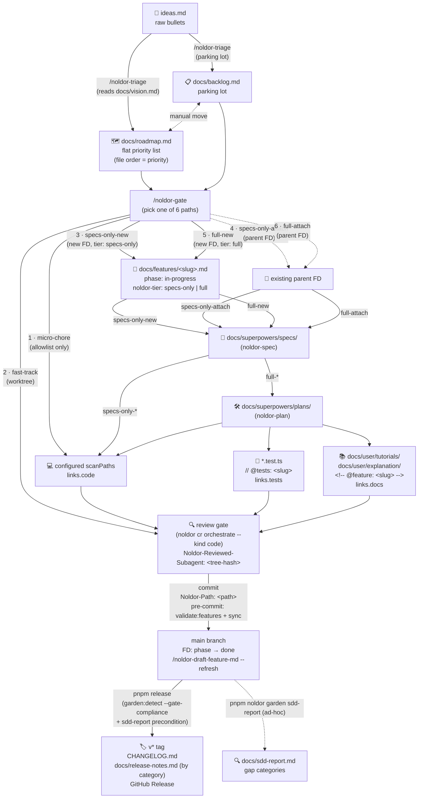
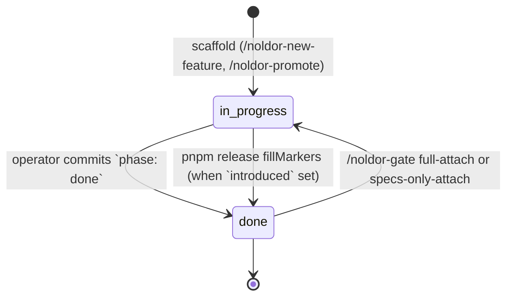

# Lifecycle

The Noldor dev-loop ships as five interlocking sub-systems: feature MDs, versioning, testing, docs generation, triage + SDD awareness. End-to-end lifecycle of a single feature:

## Six gate paths

The six gate paths map onto the diagram above. Every change picks exactly one path via [`/noldor-gate`](../../.claude/skills/noldor-gate/SKILL.md) before any implementation:

1. **`micro-chore`** — doc/policy edits matching the allowlist; no FD, no worktree, no reviewer.
2. **`fast-track`** — small code change that doesn't warrant an FD; worktree + reviewer required.
3. **`specs-only-new`** — design needed but small enough that the spec is sufficient context for direct implementation; new FD (`tier: specs-only`) + worktree + spec + reviewer (no separate plan).
4. **`specs-only-attach`** — design-light enhancement under an existing FD; worktree + spec + reviewer (no new FD, no separate plan).
5. **`full-new`** — new design AND plan decomposition warranted; new FD (`tier: full`) + worktree + spec + plan + reviewer.
6. **`full-attach`** — substantial enhancement under an existing FD; worktree + spec + plan + reviewer (no new FD).

Every commit on paths 2–6 carries a `Noldor-Path: <path>` trailer (auto-injected from the session marker). The review receipt (`Noldor-Reviewed-Subagent: <tree-hash>`) is amended onto the tip commit at gate Step 4; the pre-push hook validates it against `HEAD^{tree}`.

Commits land on `main` either directly (trunk-based) or via short-lived PR branches with agent auto-merge — the consumer chooses; see [`pr-flow.md`](pr-flow.md). Either way the pre-commit hook is the gate (`noldor validate features`, `noldor sync *`, `noldor checks invariants`, `noldor checks shared-files`, `noldor hooks pre-commit`).

## End-of-flow handoff

After `/noldor-gate` Step 4's scripted cleanup completes, `/noldor-gate` Step 5 runs `pnpm noldor next-priority` to check whether the priority queue in `docs/roadmap.md` (file order = priority) is empty. The session does NOT auto-continue into the next feature — by policy, the operator runs `/clear` and re-enters `/noldor-gate`, which reads top-of-roadmap directly at Step 0 and surfaces it. Fresh context per feature prevents drift toward narrow / partial deliveries that miss the prior entry's full intent (see `src/core/next-priority.ts` for the parser and `.claude/skills/noldor-gate/SKILL.md` Step 0 + Step 5 for the orchestration).

## Stage map

How the pieces connect:

| Stage        | Artifact                                                                                         | Tooling                                                                                                   |
| ------------ | ------------------------------------------------------------------------------------------------ | --------------------------------------------------------------------------------------------------------- |
| **Capture**  | `ideas.md` (raw)                                                                                 | manual                                                                                                    |
| **Triage**   | `docs/roadmap.md` (flat priority list, file order = priority) or `docs/backlog.md` (parking lot) | `/noldor-triage` skill, `pnpm noldor triage list-untriaged`                                                      |
| **Track**    | `docs/features/<slug>.md` (frontmatter + body)                                                   | `/noldor-new-feature`, `pnpm noldor validate features`                                                           |
| **Spec**     | `docs/superpowers/specs/<date>-<slug>-design.md` (non-trivial only)                              | `noldor-spec` skill (skipped when complexity verdict = `skip-brainstorm`)                     |
| **Plan**     | `docs/superpowers/plans/<date>-<slug>.md`                                                        | `noldor-plan` skill                                                                           |
| **Code**     | `packages/`, `apps/` (`links.code`)                                                              | typecheck + Vitest                                                                                        |
| **Tests**    | `*.test.ts` with `// @tests: <slug>`                                                             | `pnpm noldor sync test-links` populates `links.tests`                                                     |
| **Docs**     | `docs/user/tutorials/`, `docs/user/explanation/` with `<!-- @feature: <slug> -->`                | `pnpm noldor sync doc-links` populates `links.docs`, `pnpm docs:build` rebuilds                           |
| **Validate** | (cross-checks)                                                                                   | `pnpm noldor validate features` (schema + `@tests:` + `@feature:` slugs); pre-commit hook runs sync chain |
| **Release**  | `v<x.y.z>` tag, `CHANGELOG.md`, `docs/release-notes.md`                                          | `pnpm release` (semver bump auto-derived from conventional commits; fills `introduced`/`updated`)         |
| **Audit**    | `docs/sdd-report.md` (13 gap categories)                                                         | `pnpm noldor garden sdd-report` (informational; release script regenerates as precondition)               |
| **Garden**   | stale plans, unused backlog, rule contradictions, invariant violations                           | `/noldor-garden` skill, backed by `pnpm noldor garden detect`                                                    |

## Phase transitions

FD `phase` is orthogonal to the pipeline Stage map above — Stage tracks "where in the workflow does this FD's artifact live"; `phase` tracks "is this FD shipped or still being built." The state machine:

| Transition                                  | Trigger                                                                                                                      | Notes                                                                                                                                                                                                                                                                                                    |
| ------------------------------------------- | ---------------------------------------------------------------------------------------------------------------------------- | -------------------------------------------------------------------------------------------------------------------------------------------------------------------------------------------------------------------------------------------------------------------------------------------------------- |
| `[*] → in-progress` (scaffold)              | `/noldor-new-feature <slug>` or `/noldor-promote <slug>` scaffolds the FD with `phase: in-progress`.                                       | `in-progress` is the initial state for any new FD — the schema enum is `done \| in-progress` only; there is no `proposed` value.                                                                                                                                                                          |
| `in-progress → done` (first ship)           | Operator commits `phase: done` in the shipping commit before `pnpm release`.                                                 | `fillMarkers` sets `introduced = <newVersion>` in the same release cycle. Triggers the `### Initial Release (v<X>)` changelog block.                                                                                                                                                                     |
| `done → in-progress` (attach revert)        | `/noldor-gate full-attach` or `/noldor-gate specs-only-attach` on a `phase: done` parent FD writes a revert commit on the worktree branch. | No-op when parent phase is already `in-progress`. The PR squash-merges to main, so main reflects `in-progress` for the duration between merge and next release. See [pr-flow.md](pr-flow.md) §Changelog Integration.                                                                       |
| `in-progress → done` (release auto-restore) | `pnpm release` runs `fillMarkers` and detects `phase: in-progress` + `introduced` already set + changelog block this cycle.  | Asymmetric counterpart to the attach revert. Squash-merge would otherwise erase the (in-progress) signal — see the [changelog-pr-flow-integration spec](../superpowers/specs/2026-05-15-framework-pr-flow-agent-auto-merge-changelog-pr-flow-integration-design.md) §3.5. Sets `updated = <newVersion>`. |

See the [changelog-pr-flow-integration spec](../superpowers/specs/2026-05-15-framework-pr-flow-agent-auto-merge-changelog-pr-flow-integration-design.md) §3 for the full asymmetric state-machine rationale.

## Tag conventions

Tag conventions enforce traceability:

- Test files declare `// @tests: <slug>` as the first non-import line — `pnpm noldor sync test-links` writes paths back onto feature MD `links.tests`.
- Tutorials + explanations declare `<!-- @feature: <slug> -->` near the top — `pnpm noldor sync doc-links` writes paths back onto `links.docs`.
- Conventional Commits (`feat:` / `fix:` / `feat!:`) drive the semver bump in `pnpm release`.
- `phase: done` without `introduced` is a normal mid-flight state — release script fills `introduced` on the next cut.
