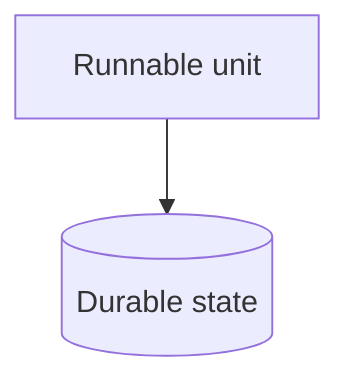

# Containers

Runnable units and what they own — and only that. Internal dependency direction
belongs on `modules.md`. A repo with no backend still has an answer here: its
runnable units are whatever it ships.

<!-- TODO: draw the real container diagram, fill in the sections, and delete this line -->

## Runnable units

<!-- what belongs here: each deployable or runnable thing, one line each. -->

## Durable state

<!-- what belongs here: each store, and which unit owns it. -->

## Topology

<!-- what belongs here: what runs where. "One npm package, nothing to deploy" is a real
     answer. If the section does not apply at all, decline it with a section-cut marker
     rather than deleting the heading — `noldor docs architecture --check` prints the
     exact syntax. -->
