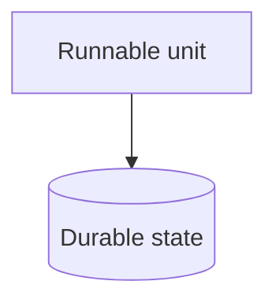

# Containers

The deployable and runnable units: frontend app, backend service, database,
worker, CLI, infrastructure. What runs where, and what talks to what.

A repo with no backend still has an answer here — its runnable units are
whatever it ships. Replace the diagram, then describe each unit in prose,
including what durable state it owns.

<!-- TODO: draw the real container diagram and delete this line -->

