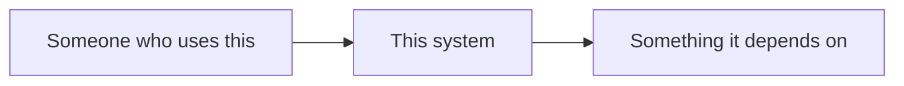

# Context

The system, its actors, and the externals it talks to. One level above the code:
who uses this, and what it depends on that you do not control.

Replace the diagram below, then write a paragraph naming each actor and external
in prose — a reader or agent consuming this file without rendering mermaid needs
the same information the picture carries.

<!-- TODO: draw the real context diagram and delete this line -->

