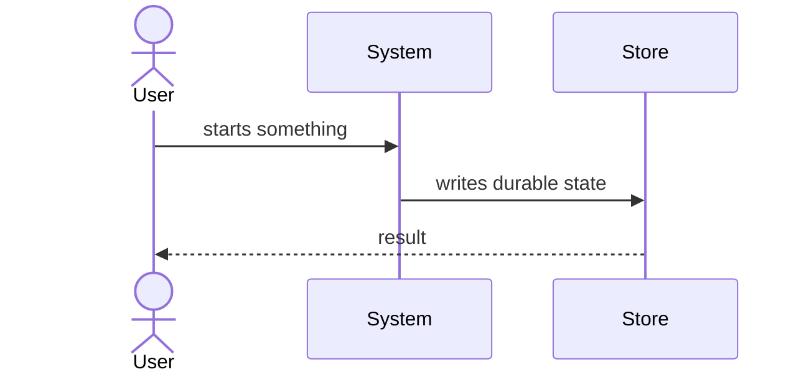

# Flows

The two or three load-bearing runtime flows, end to end. Not every flow — the
ones whose sequence a new maintainer has to know before changing anything.

Replace the diagram, then summarise each flow in prose: what starts it, what it
touches in order, and how it ends.

<!-- TODO: draw the real flow diagrams and delete this line -->

