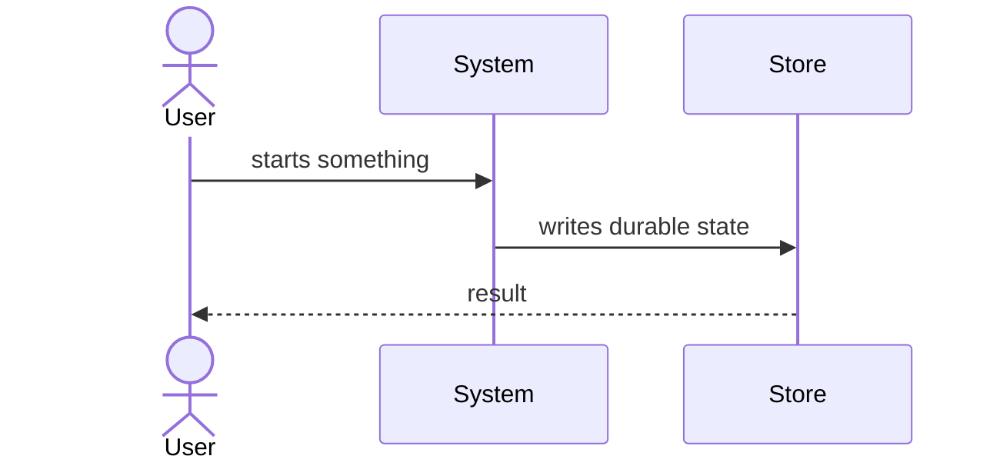

# Flows

The two or three load-bearing runtime flows, end to end — and only those. Not
every flow; the ones whose sequence a new maintainer has to know before changing
anything. Static structure belongs on `modules.md`.

Give each flow its own `## ` heading.

<!-- TODO: draw the real flow diagrams, name the real flows, and delete this line -->

## First flow

<!-- what belongs here: what starts it, what it touches in order, how it ends. -->

## Second flow

<!-- what belongs here: the same, for the next load-bearing flow. Delete this section if there is only one. -->
