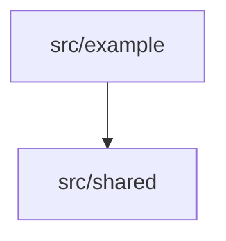

# Modules

Internal dependency direction and state ownership — and only that. Runnable
units belong on `containers.md`; runtime sequences belong on `flows.md`.

Name every module directory here. `noldor docs architecture --check` reports an
advisory for any module the code has that this page never names — it matches on
the path (`src/core`, `packages/api`), so use real paths in the diagram.

<!-- TODO: draw the real module diagram, fill in the sections, and delete this line -->

## Dependency direction

<!-- what belongs here: which way imports point, and which module depends on nothing. -->

## State ownership

<!-- what belongs here: which module writes which durable file or store. A table works well. -->
