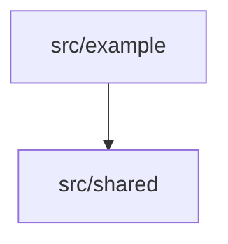

# Modules

Internal dependency direction, and which module owns which durable state.

Name every module directory here. `noldor docs architecture --check` reports an
advisory for any module the code has that this page never names — it matches on
the path (`src/core`, `packages/api`), so use real paths in the diagram.

<!-- TODO: draw the real module diagram and delete this line -->

